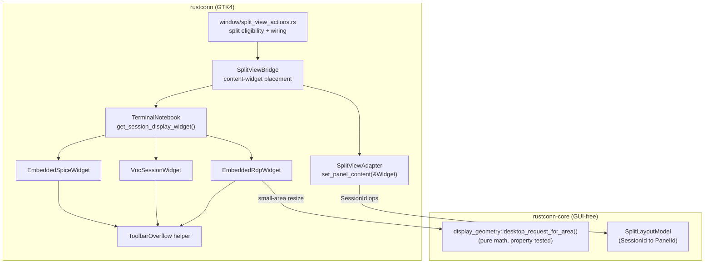

# Design Document

## Overview

This design extends the existing split-view system to host in-process embedded protocol viewers
(IronRDP embedded RDP, embedded VNC, embedded SPICE) as first-class panel content, alongside the
existing VTE terminal sessions. It also promotes two behaviors to the embedded viewer widgets
themselves — adaptive toolbar overflow and adaptive resolution/scaling — so they work identically in
a split panel, a single-session tab, or a narrow/small application window.

The core insight from the code investigation is that the split system is already protocol-agnostic
at the model layer and *almost* generic at the widget layer:

- `rustconn-core::split::SplitLayoutModel` tracks only `SessionId → PanelId`. It needs **no change**.
- `rustconn::split_view::adapter::SplitViewAdapter::set_panel_content()` already accepts
  `&impl IsA<gtk4::Widget>` — any widget.
- `rustconn::terminal` already exposes `get_session_display_widget(session_id) -> Option<Widget>`,
  which returns the VNC/RDP/SPICE display widget (and `None` for `ExternalProcess`). It is currently
  `#[expect(dead_code)]` — this feature wires it up.

The only hard blockers are:

1. `SplitViewBridge` is hardwired to `vte4::Terminal` (`SharedTerminals`, `get_terminal`,
   `add_session(_, Option<Terminal>)`, `wrap_terminal_for_panel`, `move_session_to_panel_with_terminal`).
2. `window/split_view_actions.rs` gates split on a hardcoded VTE-protocol allowlist and its
   Select-Tab provider filters to the same allowlist.

This design replaces the terminal-specific placement path with a uniform **content-widget** path,
replaces the allowlist with a **split-eligibility** decision, and adds the two widget-level adaptive
behaviors.

## Requirements Mapping

| Requirement | Design section |
|---|---|
| R1 Allow splitting embedded | Split eligibility; window actions |
| R2 Reparent viewers live | Content-widget placement path; reparenting |
| R3 Drag-and-drop | Drop target (already generic); content lookup |
| R4 Select-Tab | Session provider; content placement |
| R5 Focus & input routing | Focus grab on content widget |
| R6 Close & eviction | Eviction reparents content widget |
| R7 Color coding | Unchanged (session-id keyed) |
| R8 Broadcast degradation | Broadcast gating helper |
| R9 Lifecycle / reconnect-in-split | In-widget reconnect banner (already present) |
| R10 Crate boundary | Core unchanged; geometry helper in core |
| R11 Mixed splits | Content-widget path is protocol-uniform |
| R12 Toolbar overflow | `ToolbarOverflow` in embedded widgets |
| R13 Resolution/scaling | `desktop_request_for_area` core helper + draw fill |
| R14 Special keys / clipboard by focus | Focus-scoped routing; key release on blur |

## Architecture



The crate boundary is preserved: `rustconn-core` gains only a pure geometry function and keeps zero
GTK/adw/vte imports.

## Components and Interfaces

### 1. Split eligibility (replaces the allowlist)

Today `split_view_actions.rs` inlines the same protocol allowlist twice (horizontal/vertical) and a
third time in the Select-Tab provider. Replace all three with one helper on the notebook, keyed on
the stored widget kind rather than a protocol string, so external-process sessions are correctly
declined even for rdp/vnc/spice.

```rust
// rustconn/src/terminal/mod.rs (new)
pub enum SplitEligibility {
    /// VTE terminal or an in-process embedded viewer — can be split.
    Embeddable,
    /// rdp/vnc/spice running via an external process/viewer — cannot be embedded.
    ExternalViewer,
    /// No live session/widget for this id.
    None,
}

impl TerminalNotebook {
    #[must_use]
    pub fn split_eligibility(&self, session_id: Uuid) -> SplitEligibility { /* inspect
        session_widgets: Vnc/EmbeddedRdp/EmbeddedSpice/terminal => Embeddable;
        ExternalProcess => ExternalViewer; missing => None */ }
}
```

Window actions become:

```rust
match notebook.split_eligibility(current_session) {
    SplitEligibility::Embeddable => { /* proceed with split */ }
    SplitEligibility::ExternalViewer => {
        show_toast(&i18n("Split view is not available for external-viewer sessions. \
                          Switch this connection to embedded mode to use split."),
                   ToastType::Warning);
        return;
    }
    SplitEligibility::None => return,
}
```

The old toast "Split view is available for terminal-based sessions only" is removed.

### 2. Content-widget placement path (bridge generalization)

`SplitViewBridge` stops treating content as `vte4::Terminal` and instead resolves a generic
`gtk4::Widget` per session through a single lookup, backed by the notebook's existing
`get_session_display_widget()`.

Key API changes on `SplitViewBridge`:

| Current (terminal-only) | New (uniform) |
|---|---|
| `add_session(session, Option<Terminal>)` | `add_session(session)` — widget resolved on demand |
| `get_terminal(id) -> Option<Terminal>` | keep for broadcast; add `content_widget(id) -> Option<Widget>` |
| `wrap_terminal_for_panel(&Terminal)` | `wrap_content_for_panel(&Widget)` (scrollbar only for VTE) |
| `move_session_to_panel_with_terminal(uuid, id, &Terminal)` | `move_session_to_panel(uuid, id, &Widget)` |
| `detach_terminal_from_parent(&Terminal)` | `detach_from_parent(&Widget)` (generic) |

The widget is supplied by the caller (window actions) via a **content provider** closure, exactly
like the existing Select-Tab provider, so the bridge never needs to know protocol types:

```rust
// provider closure passed from window actions
move |session_id| notebook.get_session_display_widget(session_id) // Option<Widget>
```

Because the placement widget is the *same instance* held by the notebook (an `Rc`-owned
`EmbeddedRdpWidget`/`VncSessionWidget`/`EmbeddedSpiceWidget` whose `.widget()` is stable), moving it
between a tab and a panel is a pure GTK reparent (`unparent` then `append`) — the live protocol
connection is untouched (R2.3, R2.4). `set_panel_content()` already unparents before appending.

The VTE-only scrollbar wrapper (`wrap_terminal_for_panel`) becomes conditional: wrap with a
scrollbar only when the content is a `vte4::Terminal`; embedded widgets are placed directly.

### 3. Reparenting and lifecycle

- **Place / move / evict**: all go through `move_session_to_panel` → `set_panel_content` (detach +
  attach). The embedded widget's internal toolbar and reconnect banner are children of its own
  container, so they travel with it automatically (verified in `embedded_rdp/mod.rs`,
  `embedded_spice.rs`).
- **Disconnect in a panel (R9)**: no split-side handling is needed to *show* reconnect — each
  embedded widget already appends a `reconnect_banner` with a `Reconnect` button to its container and
  toggles it on the `Disconnected`/`Error` state. The design's only rule is **negative**: the split
  disconnect path must NOT close the panel or collapse the split for embedded sessions. Terminal
  sessions keep their existing behavior.
- **Close pane / eviction (R6)**: evicting an embedded session to a new root tab reparents the same
  widget instance back into a `TabPage` (reverse of placement); the connection is preserved.
- **Session close (R9.4/9.5)**: dropping the `Rc<…Widget>` from `session_widgets` frees it as today.

### 4. Focus and input routing (R5, R14)

The existing click handler calls `get_terminal(id)?.grab_focus()`. Generalize to
`content_widget(id)?.grab_focus()` so an embedded viewer's drawing area receives focus. RDP/VNC/SPICE
widgets are focusable (they install key controllers on their `drawing_area`).

- Ctrl+Alt+Del and clipboard copy/paste already act on the *active* session via the window actions
  and each widget's own toolbar; with per-panel focus tracked by the bridge, "active embedded
  session" resolves to the focused panel's session. No cross-panel leakage.
- Key-release-on-blur already exists in `embedded_rdp/input.rs` (releases held keys when the widget
  loses focus). VNC/SPICE follow the same pattern where they track modifiers.
- Super / Alt+Tab are intentionally **not** captured (R14.4) — left to the compositor.

### 5. Broadcast degradation (R8)

Broadcast mirrors VTE `commit` signals; it is meaningless for embedded viewers. Add a small gate:

```rust
impl SplitViewBridge {
    fn terminal_sessions(&self) -> Vec<Uuid> { /* active_sessions filtered to those with a VTE terminal */ }
    fn has_embedded_panel(&self) -> bool { /* any active session without a VTE terminal */ }
}
```

- `refresh_broadcast_toggle` shows the toggle only when `terminal_sessions().len() >= 2` and the
  focused panel is a terminal (R8.2, R8.3).
- `wire_broadcast_for_session` is only ever called for terminal sessions; embedded sessions are
  skipped, so mirroring stays among terminals only (R8.1, R8.4, R8.5).

### 6. Toolbar overflow (R12) — widget-level

Each embedded widget builds its toolbar as a horizontal `GtkBox` (`embedded-toolbar`). Add a reusable
`ToolbarOverflow` that watches the widget's allocated width and moves **Secondary_Toolbar_Actions**
between the toolbar and an overflow popover, keeping **Primary_Toolbar_Actions** (Fit resolution,
Ctrl+Alt+Del) always visible.

```rust
// rustconn/src/embedded_rdp/ (and shared by spice/vnc) — GUI helper
struct ToolbarOverflow {
    overflow_button: gtk4::MenuButton, // "…", flat, tooltip "More actions"
    overflow_box: gtk4::Box,           // popover content
    secondary: Vec<gtk4::Widget>,      // Copy, Paste, Autotype, Scripts, Quick actions, Save Files
    threshold_px: i32,                 // documented magic constant
}
```

Mechanism (no GAction refactor — reparent the existing widgets so their handlers stay bound):

1. On the widget's `connect_resize` (already wired for resolution), read the current width.
2. If `width < threshold` and not already collapsed → move each `secondary` widget from the toolbar
   into `overflow_box`, show `overflow_button`.
3. If `width >= threshold` and currently collapsed → move them back, hide `overflow_button`.
4. A hysteresis margin around `threshold` prevents flapping at the breakpoint.

`Autotype`/`Scripts`/`Quick actions` are already `MenuButton`s with menu models; they reparent as-is.
The threshold is chosen from the natural width of the primary actions plus the overflow button
(documented `// ponytail:` constant, tunable). This lives entirely in the GUI crate.

### 7. Adaptive resolution & scaling (R13) — widget-level

Split the concern into a **pure core helper** (testable, GUI-free) and a **GUI application** step.

#### 7a. Core helper (rustconn-core, property-tested)

```rust
// rustconn-core/src/display_geometry.rs (new module, no GTK)
/// Computes the remote desktop resolution and DPI scale to request for a given
/// on-screen area, guaranteeing the area is fully filled and the remote stays
/// at or above the minimum resolution.
///
/// # Errors
/// None — always returns a valid request (min-clamped).
pub struct DesktopRequest { pub width: u32, pub height: u32, pub scale_percent: u16 }

#[must_use]
pub fn desktop_request_for_area(
    area_w: u32, area_h: u32,     // device px of the panel/widget
    min_w: u32, min_h: u32,       // 640x480 for RDP
    base_scale_percent: u16,      // from config/display (100, 140, …)
) -> DesktopRequest;
```

Algorithm:

- If `area_w >= min_w && area_h >= min_h`: return `{ area_w, area_h, base_scale_percent }` (rounded to
  even), i.e. today's behavior — request matches the panel (R13.1).
- Else (area below minimum): scale the area **up**, preserving its aspect ratio, by the smallest
  integer factor `k in {2, 3}` such that `area_w*k >= min_w && area_h*k >= min_h`; request
  `{ area_w*k, area_h*k }` and `scale_percent = base_scale_percent * k` clamped to a supported set
  (100/200/300). The local view then downscales that frame by `1/k` to fully fill the panel
  (R13.2). Because the requested resolution matches the panel's aspect ratio, the aspect-preserving
  downscale fills the area with no letterbox (R13.4).

This makes the "200%/300% for tiny windows" behavior a deterministic function of the area, and it is
directly property-testable.

#### 7b. GUI application

`embedded_rdp/resize.rs` currently *skips* any request below 640x480. Replace that early `return`
with a call to `desktop_request_for_area(...)`:

- Send `RdpClientCommand::SetDesktopSize { width, height, scale_percent }` via Display Control
  (MS-RDPEDISP) — no reconnect (R13.6). The command already carries `scale_percent`.
- The draw path scales the framebuffer to fill. Today `transform_widget_to_rdp` uses `min(...)`
  (aspect-fit → possible letterbox). Since the requested resolution now matches the panel aspect,
  fit == fill; no draw change is required for RDP. Keep aspect-fit as the safety fallback while a
  resize is mid-flight (R13.5).
- VNC/SPICE: where the server supports dynamic resize, apply the same helper; where it does not
  (R13.3), scale the fixed frame to fill (aspect-fit of the last frame; letterbox only if the server
  refuses a matching-aspect resolution — documented limitation).

Because this logic is a property of the widget, it fires on any resize — split panel or a shrunk
single-tab window — satisfying "make the app window very small/narrow" (R13, container-agnostic).

## Data Models

```rust
// rustconn-core/src/display_geometry.rs
pub struct DesktopRequest { pub width: u32, pub height: u32, pub scale_percent: u16 }

// rustconn/src/terminal/mod.rs
pub enum SplitEligibility { Embeddable, ExternalViewer, None }
```

No changes to `rustconn-core::split` data models. `SessionWidgetStorage` is unchanged; the design
only *reads* it via `get_session_display_widget()` / a new `split_eligibility()`.

## Correctness Properties

Target: `rustconn-core::display_geometry::desktop_request_for_area` (pure, in core → PBT lives in
`rustconn-core` tests, consistent with project policy).

### Property 1: Minimum honored

For all areas, `result.width >= min_w && result.height >= min_h`.

**Validates: Requirements 13.1, 13.2**

### Property 2: Aspect preserved

`result.width / result.height ~= area_w / area_h` within the even-rounding tolerance (the request
introduces no distortion).

**Validates: Requirements 13.2, 13.4**

### Property 3: Fill without over-request when large enough

If `area >= min` in both dims, the result equals the area (rounded to even) and
`scale_percent == base_scale_percent`.

**Validates: Requirements 13.1**

### Property 4: Bounded scale

`result.scale_percent in {base, base*2, base*3}`, never exceeds the supported ceiling, and is
non-decreasing as the area shrinks.

**Validates: Requirements 13.2**

### Property 5: Determinism and idempotence

Same inputs produce the same output; feeding the result's own size back in (as a "large" area) is
stable.

**Validates: Requirements 13.1, 13.2**

### Property 6: Never degenerate

Width and height are even and non-zero for any non-zero area.

**Validates: Requirements 13.2, 13.4**

Non-core behaviors (reparenting preserves connection, toolbar overflow reachability, focus routing)
are covered by targeted unit tests where mockable and by a manual GTK verification checklist.

## Error Handling

- **Missing content widget** for a requested session (R2.5): leave the panel empty and
  `tracing::warn!` with the session id — no panic, no partial state.
- **External-viewer session** split attempt (R1.4): declined with the specified toast; layout
  unchanged. `ExternalProcess` returns `None` from `get_session_display_widget`, so it can never be
  placed even via drag/Select-Tab (the provider excludes it — R4.3).
- **Server rejects dynamic resize** (R13.3): fall back to scaling the fixed frame; log at debug.
- All new fallible paths return via existing `Result`/`Option`; no new `unwrap`/`expect` on runtime
  state (M-PANIC-ON-BUG).

## Testing Strategy

1. **Property tests (rustconn-core)**: `desktop_request_for_area` — properties P1–P6 via `proptest`.
2. **Unit tests (rustconn)**: `split_eligibility` mapping for each `SessionWidgetStorage` variant and
   the terminal fallback; broadcast gating (`terminal_sessions`, `has_embedded_panel`).
3. **Manual GTK checklist** (documented in the tasks): split an RDP/VNC/SPICE tab; drag between
   panels without disconnect; Select-Tab into an empty panel; mixed terminal+embedded split; shrink
   window until toolbar overflows and the desktop stays fully filled; disconnect in a panel shows the
   reconnect banner and keeps the split; evict to a new tab preserves the connection.
4. **Regression**: existing terminal split behavior and property-test coverage must stay green.

## Crate Boundary Compliance

- `rustconn-core` gains only `display_geometry` (pure math). No `gtk4`/`adw`/`vte4` imports.
- All widget, reparenting, toolbar, and focus logic stays in `rustconn`.
- `SplitLayoutModel` remains `SessionId`-keyed and protocol-agnostic (R10).

## Out of Scope

- External-process viewers (xfreerdp/vncviewer/external SPICE) in split — explicitly declined.
- Capturing compositor shortcuts (Super/Alt+Tab) into embedded panels.
- Broadcast/keystroke mirroring into embedded sessions.
- Release execution — 0.18.1 is a development branch here.
