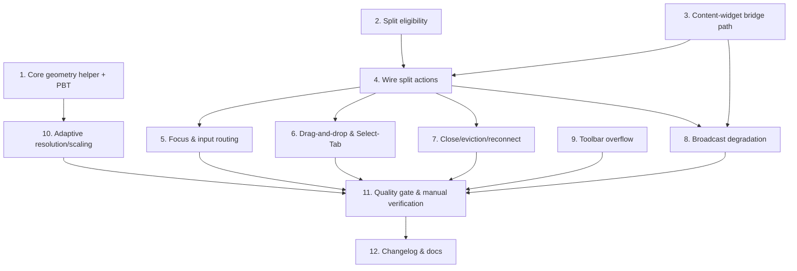

# Implementation Plan

## Overview

Target: 0.18.1 development branch (no release execution). Commit after each completed numbered
feature. Keep the crate boundary: `rustconn-core` stays GUI-free. The plan front-loads the pure,
property-tested core helper, then generalizes the split bridge to a uniform content-widget path,
enables embedded splitting end-to-end, and finishes with the widget-level adaptive behaviors
(toolbar overflow, resolution/scaling) plus documentation.

## Task Dependency Graph



```json
{
  "waves": [
    { "wave": 1, "tasks": ["1", "2", "3", "9"] },
    { "wave": 2, "tasks": ["4", "10"] },
    { "wave": 3, "tasks": ["5", "6", "7", "8"] },
    { "wave": 4, "tasks": ["11"] },
    { "wave": 5, "tasks": ["12"] }
  ]
}
```

## Tasks

- [x] 1. Core display-geometry helper with property tests
  - Create `rustconn-core/src/display_geometry.rs` (no gtk4/adw/vte imports) with
    `DesktopRequest { width, height, scale_percent }` and
    `desktop_request_for_area(area_w, area_h, min_w, min_h, base_scale_percent) -> DesktopRequest`.
  - Implement the algorithm: area >= min → request area (rounded to even), base scale; area < min →
    smallest integer factor k in {2,3} preserving aspect so both dims >= min, `scale_percent =
    base * k` clamped to {100,200,300}.
  - Add `# Errors`/`# Panics` doc sections; document the magic constants (min 640x480, scale set).
  - Export the module from `rustconn-core/src/lib.rs`.
  - _Requirements: 13.1, 13.2, 13.3, 13.4, 10.5_

- [x] 1.1 Property tests for `desktop_request_for_area`
  - Add `rustconn-core` property tests (proptest) covering Properties 1–6 from the design
    (minimum honored, aspect preserved, fill-without-over-request, bounded scale, determinism/
    idempotence, never-degenerate).
  - Run `cargo test -p rustconn-core` and ensure green.
  - _Requirements: 13.1, 13.2, 13.4_

- [x] 1.2 Commit
  - Commit: "feat(core): add display_geometry::desktop_request_for_area with property tests".

- [x] 2. Split eligibility on the notebook
  - Add `SplitEligibility { Embeddable, ExternalViewer, None }` and
    `TerminalNotebook::split_eligibility(session_id)` in `rustconn/src/terminal/`, mapping
    `SessionWidgetStorage` (Vnc/EmbeddedRdp/EmbeddedSpice/terminal => Embeddable; ExternalProcess =>
    ExternalViewer; missing => None).
  - Add unit tests for each variant and the terminal fallback.
  - _Requirements: 1.1, 1.2, 1.4, 4.3_

- [x] 3. Content-widget placement path in `SplitViewBridge`
  - [x] 3.1 Generalize storage/lookup from `Terminal` to `gtk4::Widget`
    - Add a `content_widget(session_id) -> Option<Widget>` resolution backed by a provider closure
      that the window wires to `notebook.get_session_display_widget()`. Keep `get_terminal` for
      broadcast only.
    - Replace `wrap_terminal_for_panel` with `wrap_content_for_panel` (scrollbar only when the
      content is a `vte4::Terminal`; embedded widgets placed directly), and make
      `detach_from_parent` generic.
    - _Requirements: 2.1, 2.2, 2.3, 2.6, 10.4, 11.1, 11.2_
  - [x] 3.2 Generalize placement/move APIs
    - Replace `add_session(_, Option<Terminal>)` with `add_session(session)` and
      `move_session_to_panel_with_terminal(...)` with `move_session_to_panel(uuid, id, &Widget)`
      routing through `set_panel_content` (detach + attach).
    - Ensure a single instance of each embedded widget is retained across placements (R2.6).
    - _Requirements: 2.1, 2.2, 2.5, 2.6, 10.4_
  - [x] 3.3 Commit
    - Commit: "refactor(split): generalize bridge to a uniform content-widget path".

- [x] 4. Wire split actions to eligibility and content provider
  - In `window/split_view_actions.rs`, replace both inlined VTE allowlists with
    `notebook.split_eligibility(...)`: Embeddable → proceed; ExternalViewer → toast "Split view is
    not available for external-viewer sessions. Switch this connection to embedded mode to use
    split."; None → return. Remove the old "terminal-based sessions only" toast.
  - Pass the content provider (`get_session_display_widget`) into the bridge for initial placement.
  - Add the new i18n string; run `bash po/update-pot.sh` and `msgmerge --update` for the 16 languages.
  - _Requirements: 1.1, 1.2, 1.3, 1.4, 1.5_

- [x] 4.1 Commit
  - Commit: "feat(split): allow splitting embedded RDP/VNC/SPICE; decline external viewers".

- [x] 5. Focus and input routing for embedded panels
  - Generalize the panel click handler from `get_terminal(id)?.grab_focus()` to
    `content_widget(id)?.grab_focus()` so embedded drawing areas receive focus; keep terminal
    behavior unchanged.
  - Verify Ctrl+Alt+Del and clipboard copy/paste resolve to the focused panel's session; confirm
    key-release-on-blur is active for RDP (and VNC/SPICE where modifiers are tracked).
  - _Requirements: 5.1, 5.2, 5.3, 5.4, 14.1, 14.2, 14.3, 14.4, 11.4_

- [x] 6. Drag-and-drop and Select-Tab for embedded sessions
  - Update the Select-Tab session provider to include embedded sessions and exclude
    ExternalProcess sessions and already-displayed sessions.
  - Confirm the existing drop target places/moves/evicts embedded sessions via the content-widget
    path (no terminal assumptions remain).
  - _Requirements: 3.1, 3.2, 3.3, 3.4, 3.5, 3.6, 4.1, 4.2, 4.4, 4.5, 4.6, 4.7_

- [x] 6.1 Commit (no code needed — satisfied by Tasks 3/4/7)
  - Commit: "feat(split): drag-and-drop and Select-Tab placement for embedded sessions".

- [x] 7. Close, eviction, and reconnect-in-split
  - Ensure close-pane and eviction reparent the embedded widget back into a new Root_Tab preserving
    the connection.
  - Ensure the disconnect path does NOT close the panel or collapse the split for embedded sessions;
    rely on the in-widget reconnect banner. Add a guard/test for this negative rule.
  - Stop recording on panel close; release the widget on session close.
  - _Requirements: 6.1, 6.2, 6.3, 6.4, 6.5, 9.1, 9.2, 9.3, 9.4, 9.5_

- [x] 7.1 Commit
  - Commit: "feat(split): embedded close/eviction reparenting and reconnect-in-split".

- [x] 8. Broadcast degradation with embedded panels
  - Add `terminal_sessions()` and `has_embedded_panel()` to `SplitViewBridge`; gate
    `refresh_broadcast_toggle` (show only with >= 2 terminal sessions and a focused terminal) and
    ensure `wire_broadcast_for_session` is only called for terminal sessions.
  - Add unit tests for the gating helpers.
  - _Requirements: 8.1, 8.2, 8.3, 8.4, 8.5_

- [x] 8.1 Commit
  - Commit: "feat(split): restrict keystroke broadcast to terminal sessions".

- [x] 9. Adaptive toolbar overflow in embedded widgets
  - [x] 9.1 Shared `ToolbarOverflow` helper
    - Add a GUI helper that, on width change, moves Secondary_Toolbar_Actions between the toolbar
      and an overflow `MenuButton` ("…") popover while keeping Primary_Toolbar_Actions visible;
      include a documented threshold constant and hysteresis. Reparent existing button widgets so
      their handlers stay bound.
    - _Requirements: 12.1, 12.2, 12.3, 12.4, 12.5, 12.6_
  - [x] 9.2 Apply to RDP, SPICE, and VNC toolbars
    - Wire the helper into `EmbeddedRdpWidget`, `EmbeddedSpiceWidget`, and the VNC widget; classify
      each protocol's primary vs secondary actions.
    - Add tooltips/accessibility labels for the overflow button (GNOME HIG).
    - _Requirements: 12.1, 12.2, 12.4, 12.6_
  - [x] 9.3 Commit
    - Commit: "feat(embedded): adaptive toolbar overflow for narrow panels/windows".

- [x] 10. Adaptive resolution/scaling using the core helper
  - Replace the sub-640x480 early `return` in `embedded_rdp/resize.rs` (both the debounced handler
    and `apply_resolution_sync`) with a call to
    `rustconn_core::display_geometry::desktop_request_for_area(...)`, sending
    `SetDesktopSize { width, height, scale_percent }` via Display Control without reconnect.
  - Confirm the draw path fills the area (request now matches panel aspect); keep aspect-fit as the
    mid-resize fallback.
  - Apply the same helper to VNC/SPICE where the server supports live resize; otherwise scale the
    fixed frame to fill.
  - _Requirements: 13.1, 13.2, 13.3, 13.4, 13.5, 13.6_

- [x] 10.1 Commit
  - Commit: "feat(embedded): fill small panels/windows via adaptive resolution and scaling".

- [x] 11. Quality gate and manual verification (automated: fmt/clippy/tests green; manual GTK checklist pending human QA)
  - Run `rust-quality-check` (fmt + clippy, 0 warnings) and `cargo test --workspace`.
  - Manual GTK checklist: split RDP/VNC/SPICE; drag between panels without disconnect; Select-Tab
    into empty panel; mixed terminal+embedded split; shrink window until toolbar overflows and the
    desktop stays fully filled; disconnect in a panel shows the reconnect banner and keeps the split;
    evict to a new tab preserves the connection.
  - _Requirements: 2.3, 2.4, 3.1, 3.2, 3.3, 4.1, 5.1, 6.1, 9.1, 11.1, 12.1, 13.1_

- [x] 12. Changelog and technical documentation
  - Add a 0.18.1 CHANGELOG entry describing embedded split-view support and the adaptive
    toolbar/resolution behavior.
  - Update all affected technical documentation (split-view / protocol docs, any user-facing docs
    that state split is terminal-only) to reflect embedded support and the external-viewer decline.
  - _Requirements: 1.3, 1.4, 12.6, 13.4_

- [x] 12.1 Commit
  - Commit: "docs: changelog and documentation for embedded split-view (0.18.1)".

## Notes

- Ordering rationale: the pure core helper (Task 1) has no dependencies and unlocks Task 10; the
  bridge generalization (Task 3) and eligibility (Task 2) gate the end-to-end wiring (Task 4), which
  in turn unlocks focus, drag/drop, close/eviction, and broadcast work.
- Commit granularity follows the user's rule: one commit per completed numbered feature; no release
  is performed (0.18.1 remains a development branch).
- Crate boundary: only `rustconn-core/src/display_geometry.rs` is added to core, and it must stay
  free of gtk4/adw/vte (hook-enforced). All widget/reparenting/toolbar/focus logic lives in `rustconn`.
- Property-based tests target the pure geometry helper in `rustconn-core`, matching the project's
  test policy; GTK reparenting/focus behaviors use unit tests where mockable plus the manual checklist.
- i18n: the new decline string (Task 4) and any overflow-button labels/tooltips (Task 9) must be
  wrapped in `i18n()` and the POT/translations updated.
