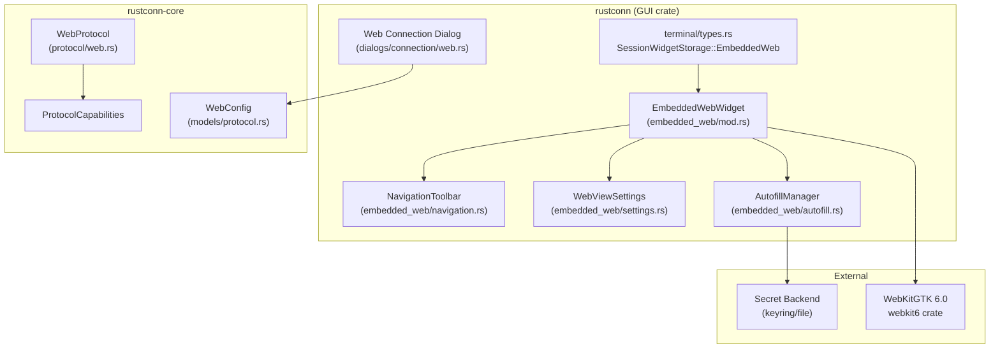
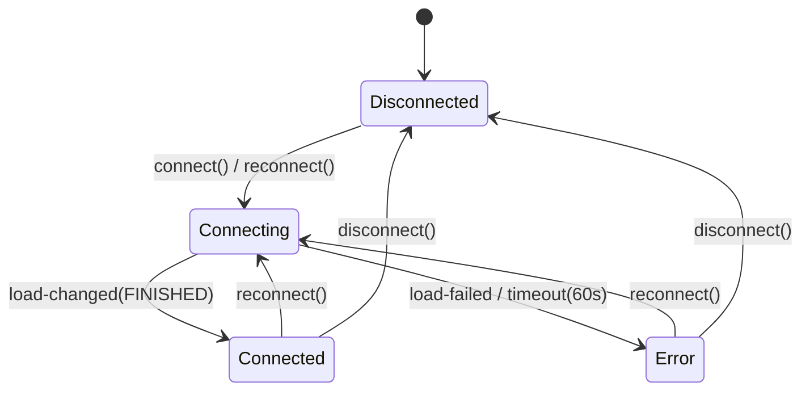
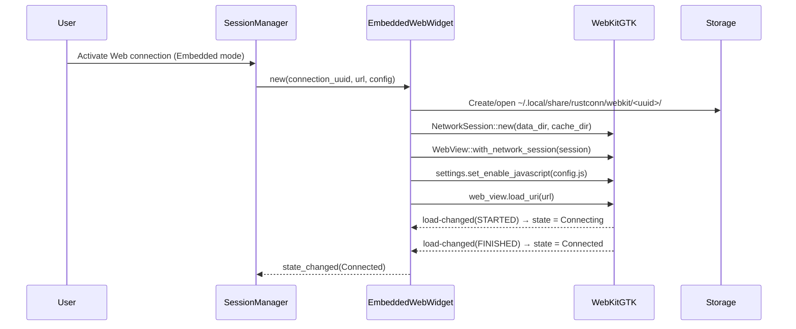
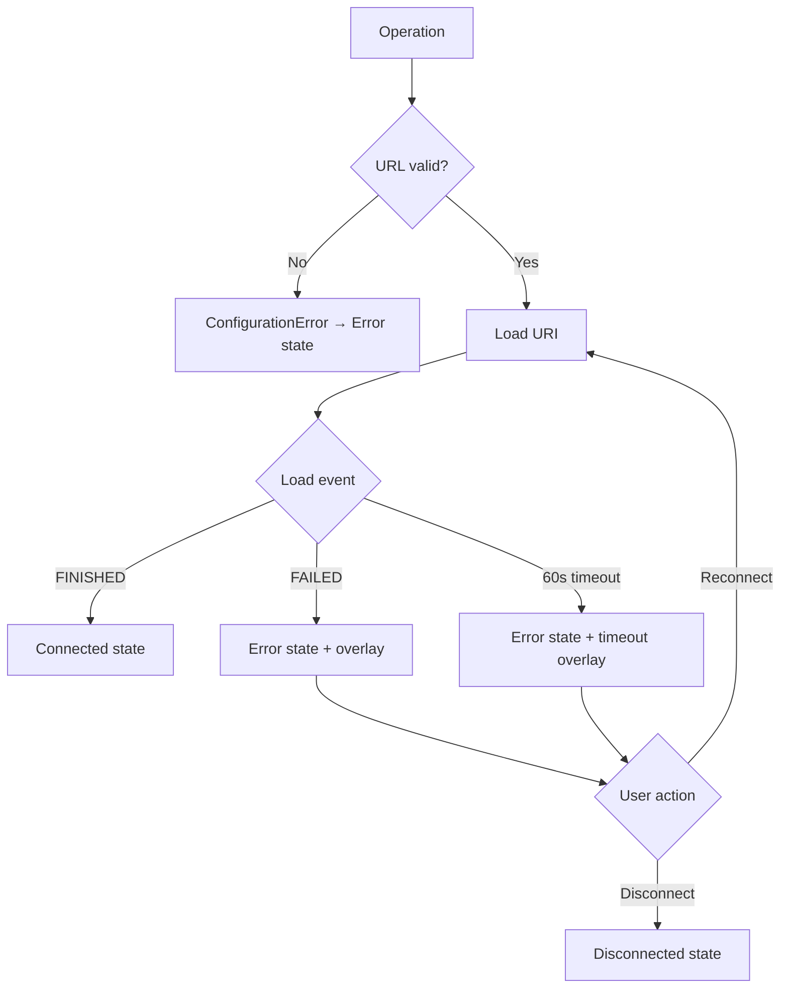

# Design Document: Embedded Web Browser

## Overview

This feature embeds a WebKitGTK 6.0 WebView widget inside RustConn tabs for Web protocol connections. Currently, Web connections delegate entirely to the system browser via `xdg-open`/`UriLauncher`. The embedded browser adds an in-tab browsing experience with navigation controls, persistent per-connection sessions (cookies/local storage), and credential autofill — all following the established `EmbeddedWidget` trait pattern used by RDP and VNC widgets.

The feature is gated behind a `web-embedded` Cargo feature flag (default on Linux, excluded on macOS where WebKitGTK is unavailable), ensuring zero compile-time impact when disabled.

### Design Goals

- Follow the established embedded widget architecture (same trait, same toolbar pattern, same state machine)
- Per-connection isolation via WebKitGTK `NetworkSession` with persistent SQLite cookies
- Minimal new dependencies — only `webkit6` (WebKitGTK 6.0 Rust bindings)
- Full conditional compilation: the crate must build without WebKitGTK headers when the feature is off

### Non-Goals

- Full-featured browser (extensions, DevTools, download manager)
- Multi-tab browsing within a single connection
- Proxy configuration (WebKitGTK inherits system proxy)

## Architecture

### High-Level Component Diagram



### Module Layout

```
rustconn/src/embedded_web/
├── mod.rs           # EmbeddedWebWidget struct, EmbeddedWidget trait impl
├── navigation.rs    # Navigation toolbar (Back/Forward/Reload/Home/Zoom)
├── settings.rs      # WebView settings configuration (JS, user-agent)
└── autofill.rs      # Credential injection (JS + authenticate signal)
```

### State Machine

The widget follows the same `EmbeddedConnectionState` lifecycle as RDP/VNC:



### Data Flow for a Web Session Launch



## Components and Interfaces

### 1. `EmbeddedWebWidget` (mod.rs)

The primary struct implementing `EmbeddedWidget`. Wraps a WebKitGTK `WebView` inside a vertical `GtkBox` with a navigation toolbar on top.

```rust
/// Embedded web browser widget using WebKitGTK 6.0.
///
/// Implements `EmbeddedWidget` for polymorphic handling alongside
/// RDP and VNC sessions in the terminal notebook.
#[cfg(feature = "web-embedded")]
pub struct EmbeddedWebWidget {
    /// Vertical container: toolbar + webview
    container: gtk4::Box,
    /// Navigation toolbar
    toolbar: NavigationToolbar,
    /// WebKitGTK WebView instance
    web_view: webkit6::WebView,
    /// Per-connection network session (persistent cookies/storage)
    network_session: webkit6::NetworkSession,
    /// Current connection state
    state: Rc<RefCell<EmbeddedConnectionState>>,
    /// Original configured URL (for Home button / reconnect)
    home_url: Rc<RefCell<String>>,
    /// Connection UUID (for storage path resolution)
    connection_uuid: Uuid,
    /// State change callback
    on_state_changed: Rc<RefCell<Option<StateCallback>>>,
    /// Error callback
    on_error: Rc<RefCell<Option<ErrorCallback>>>,
    /// Reconnect callback
    on_reconnect: Rc<RefCell<Option<ReconnectCallback>>>,
    /// Load timeout source ID
    load_timeout: Rc<RefCell<Option<glib::SourceId>>>,
    /// Autofill manager
    autofill: AutofillManager,
    /// Reconnect banner (shown on disconnect/error)
    reconnect_banner: gtk4::Box,
}
```

#### Key Methods

```rust
impl EmbeddedWebWidget {
    /// Creates a new embedded web widget.
    ///
    /// # Arguments
    /// * `connection_uuid` - UUID for per-connection session isolation
    /// * `url` - Initial URL to load
    /// * `config` - WebConfig with JS/user-agent settings
    /// * `credentials` - Optional credentials for autofill
    ///
    /// # Errors
    /// Returns `EmbeddedError::ConfigurationError` if the URL is invalid.
    pub fn new(
        connection_uuid: Uuid,
        url: &str,
        config: &WebConfig,
        credentials: Option<(String, SecretString)>,
    ) -> Result<Self, EmbeddedError>;

    /// Validates the URL scheme (http://, https://, file://).
    fn validate_url(url: &str) -> Result<(), EmbeddedError>;

    /// Creates or opens the persistent NetworkSession for this connection.
    fn create_network_session(uuid: &Uuid) -> Result<webkit6::NetworkSession, EmbeddedError>;

    /// Starts the 60-second load timeout timer.
    fn start_load_timeout(&self);

    /// Cancels any running load timeout timer.
    fn cancel_load_timeout(&self);
}
```

#### `EmbeddedWidget` Trait Implementation

```rust
#[cfg(feature = "web-embedded")]
impl EmbeddedWidget for EmbeddedWebWidget {
    fn widget(&self) -> &gtk4::Box { &self.container }

    fn state(&self) -> EmbeddedConnectionState {
        *self.state.borrow()
    }

    fn is_embedded(&self) -> bool { true } // Always embedded

    fn disconnect(&self) -> Result<(), EmbeddedError> {
        self.cancel_load_timeout();
        self.web_view.stop_loading();
        self.web_view.load_uri("about:blank");
        self.set_state(EmbeddedConnectionState::Disconnected);
        Ok(())
    }

    fn reconnect(&self) -> Result<(), EmbeddedError> {
        let url = self.home_url.borrow().clone();
        Self::validate_url(&url)?;
        self.set_state(EmbeddedConnectionState::Connecting);
        self.start_load_timeout();
        self.web_view.load_uri(&url);
        Ok(())
    }

    fn send_ctrl_alt_del(&self) {
        // No-op: Web protocol does not support remote key injection.
    }

    fn protocol_name(&self) -> &'static str { "Web" }
}
```

### 2. `NavigationToolbar` (navigation.rs)

A compact toolbar following the RDP toolbar pattern with web-specific controls.

```rust
/// Web browser navigation toolbar.
///
/// Layout: [Back] [Forward] [Reload] [Home] | Page Title | [Autofill] [Zoom+] [Zoom-] [Menu]
#[cfg(feature = "web-embedded")]
pub struct NavigationToolbar {
    container: gtk4::Box,
    back_button: gtk4::Button,
    forward_button: gtk4::Button,
    reload_button: gtk4::Button,
    home_button: gtk4::Button,
    title_label: gtk4::Label,
    autofill_button: gtk4::Button,
    zoom_in_button: gtk4::Button,
    zoom_out_button: gtk4::Button,
    menu_button: gtk4::MenuButton,
}

impl NavigationToolbar {
    /// Creates the navigation toolbar with all buttons.
    pub fn new() -> Self;

    /// Binds the toolbar to a WebView, connecting signals for
    /// can-go-back/forward, title changes, and zoom level.
    pub fn bind_to_webview(&self, web_view: &webkit6::WebView, home_url: &Rc<RefCell<String>>);

    /// Updates the zoom button sensitivity based on current zoom level.
    fn update_zoom_buttons(&self, zoom_level: f64);
}
```

#### Zoom Behavior

- Zoom range: 30% (0.3) to 300% (3.0)
- Zoom step: 10% (0.1) per button press or keyboard shortcut
- Reset: Ctrl+0 resets to 100% (1.0)
- Button sensitivity: disabled at limits

### 3. `WebViewSettings` (settings.rs)

Applies per-connection WebKit settings before loading content.

```rust
/// Applies WebConfig settings to a WebView's WebKitSettings instance.
///
/// Must be called before `web_view.load_uri()` to ensure
/// JavaScript and user-agent are configured before any content loads.
#[cfg(feature = "web-embedded")]
pub fn apply_settings(web_view: &webkit6::WebView, config: &WebConfig) {
    let settings = web_view.settings().unwrap();

    // JavaScript control
    settings.set_enable_javascript(config.javascript_enabled);

    // User agent override
    if let Some(ref ua) = config.user_agent {
        settings.set_user_agent(Some(ua));
    }

    // Hardened defaults for embedded context
    settings.set_enable_developer_extras(false);
    settings.set_allow_modal_dialogs(false);
}
```

### 4. `AutofillManager` (autofill.rs)

Handles credential injection via two mechanisms:
1. JavaScript injection for HTML forms (button-triggered)
2. WebKitGTK `authenticate` signal for HTTP Basic/Digest Auth

```rust
/// Manages credential autofill for the embedded web view.
///
/// Uses `SecretString` for all credential handling and zeroizes
/// temporary values immediately after use.
#[cfg(feature = "web-embedded")]
pub struct AutofillManager {
    /// Stored username (None if no credentials configured)
    username: Option<String>,
    /// Stored password (SecretString for zeroization)
    password: Option<SecretString>,
    /// Whether autofill is available (credentials exist)
    is_available: bool,
}

impl AutofillManager {
    /// Creates a new autofill manager with optional credentials.
    pub fn new(credentials: Option<(String, SecretString)>) -> Self;

    /// Whether autofill is available (credentials are configured).
    pub fn is_available(&self) -> bool;

    /// Injects credentials into the current page via JavaScript.
    ///
    /// Fills `input[type=password]`, `input[type=text][name*=user]`,
    /// `input[type=text][name*=login]`, `input[type=email]`,
    /// and `input[name=username]` fields.
    ///
    /// # Security
    /// Uses `SecretString` and `Zeroizing<String>` for credential handling.
    /// Temporary values are zeroized within this function scope.
    pub fn inject_credentials(&self, web_view: &webkit6::WebView);

    /// Handles the WebKitGTK `authenticate` signal for HTTP Basic/Digest.
    ///
    /// Called synchronously within the signal callback to respond
    /// before the authentication challenge times out.
    pub fn handle_authenticate(&self, request: &webkit6::AuthenticationRequest) -> bool;
}
```

#### JavaScript Injection Script

```javascript
(function() {
    const username = '%USERNAME%';
    const password = '%PASSWORD%';

    function fill(selector, value) {
        const fields = document.querySelectorAll(selector);
        fields.forEach(function(field) {
            field.value = value;
            field.dispatchEvent(new Event('input', { bubbles: true }));
            field.dispatchEvent(new Event('change', { bubbles: true }));
        });
        return fields.length;
    }

    let userFilled = fill('input[type="text"][name*="user"]', username);
    userFilled += fill('input[type="text"][name*="login"]', username);
    userFilled += fill('input[type="email"]', username);
    userFilled += fill('input[name="username"]', username);
    const passFilled = fill('input[type="password"]', password);

    return JSON.stringify({ userFilled: userFilled, passFilled: passFilled });
})();
```

### 5. `WebConfig` Extension (rustconn-core)

```rust
/// Browser mode selection for Web connections.
#[derive(Debug, Clone, Copy, PartialEq, Eq, Serialize, Deserialize)]
#[serde(rename_all = "snake_case")]
pub enum WebBrowserMode {
    /// Embedded WebKitGTK 6.0 WebView inside the tab
    #[cfg(feature = "web-embedded")]
    Embedded,
    /// System default browser (xdg-open / UriLauncher)
    System,
    /// Custom browser command
    Custom,
}

impl Default for WebBrowserMode {
    fn default() -> Self {
        #[cfg(feature = "web-embedded")]
        { Self::Embedded }
        #[cfg(not(feature = "web-embedded"))]
        { Self::System }
    }
}

/// Web bookmark configuration (extended for embedded browser).
#[derive(Debug, Clone, Default, PartialEq, Eq, Serialize, Deserialize)]
pub struct WebConfig {
    /// Custom browser command (None = system default via xdg-open / portal)
    #[serde(default, skip_serializing_if = "Option::is_none")]
    pub browser: Option<String>,
    /// Open in private/incognito mode
    #[serde(default)]
    pub private_mode: bool,
    /// Browser mode: Embedded, System, or Custom
    #[serde(default)]
    pub browser_mode: WebBrowserMode,
    /// Whether JavaScript is enabled in the embedded WebView
    #[serde(default = "default_true")]
    pub javascript_enabled: bool,
    /// Custom user agent string (None = WebKitGTK default)
    #[serde(default, skip_serializing_if = "Option::is_none")]
    pub user_agent: Option<String>,
}

fn default_true() -> bool { true }
```

### 6. `SessionWidgetStorage` Extension

```rust
/// Session widget storage for non-SSH sessions
pub enum SessionWidgetStorage {
    /// VNC session widget
    Vnc(Rc<VncSessionWidget>),
    /// Embedded RDP widget (with dynamic resolution)
    EmbeddedRdp(Rc<EmbeddedRdpWidget>),
    /// Embedded Web browser widget (WebKitGTK 6.0)
    #[cfg(feature = "web-embedded")]
    EmbeddedWeb(Rc<EmbeddedWebWidget>),
    /// External process (xfreerdp, vncviewer, etc.) — killed on tab close
    ExternalProcess(Rc<RefCell<Option<Child>>>),
}
```

### 7. `SplitEligibility` Extension

```rust
fn eligibility_from(
    has_terminal: bool,
    storage: Option<&SessionWidgetStorage>,
) -> SplitEligibility {
    match storage {
        Some(SessionWidgetStorage::Vnc(_) | SessionWidgetStorage::EmbeddedRdp(_)) => {
            SplitEligibility::Embeddable
        }
        #[cfg(feature = "web-embedded")]
        Some(SessionWidgetStorage::EmbeddedWeb(_)) => SplitEligibility::Embeddable,
        Some(SessionWidgetStorage::ExternalProcess(_)) => SplitEligibility::ExternalViewer,
        None if has_terminal => SplitEligibility::Embeddable,
        None => SplitEligibility::None,
    }
}
```

### 8. `ProtocolCapabilities` Update

```rust
impl Protocol for WebProtocol {
    fn capabilities(&self) -> ProtocolCapabilities {
        ProtocolCapabilities {
            #[cfg(feature = "web-embedded")]
            embedded: true,
            #[cfg(not(feature = "web-embedded"))]
            embedded: false,
            external_fallback: true,
            file_transfer: false,
            audio: false,
            clipboard: false,
            #[cfg(feature = "web-embedded")]
            split_view: true,
            #[cfg(not(feature = "web-embedded"))]
            split_view: false,
            terminal_based: false,
            multi_monitor: false,
            usb_redirection: false,
            port_forwarding: false,
            wayland_forwarding: false,
            x11_forwarding: false,
            session_recording: false,
            remote_monitoring: false,
            command_snippets: false,
            wake_on_lan: false,
        }
    }
}
```

### 9. Connection Dialog Update

The Web connection dialog gains a Browser Mode `adw::ComboRow` and a JavaScript toggle `adw::SwitchRow`:

```rust
/// Return type for Web options creation (extended for embedded browser).
pub struct WebOptionsWidgets {
    pub container: gtk4::Box,
    pub browser_entry: gtk4::Entry,
    pub private_mode_switch: adw::SwitchRow,
    pub browser_mode_combo: adw::ComboRow,
    pub javascript_switch: adw::SwitchRow,
    pub user_agent_row: adw::EntryRow,
}
```

The `browser_mode_combo` displays "Embedded", "System", "Custom". When `web-embedded` is disabled at compile time, "Embedded" is excluded. When Custom is selected, the browser command entry becomes required.

### 10. Persistent Session Storage

```
~/.local/share/rustconn/webkit/<connection-uuid>/
├── cookies.sqlite       # WebKitGTK cookie store
├── databases/           # IndexedDB
└── localstorage/        # localStorage

~/.cache/rustconn/webkit/<connection-uuid>/
└── (disk cache)
```

Each connection gets its own `NetworkSession` instance. When a connection is deleted, both directories are removed.

#### Fallback Behavior

If the storage directory cannot be created (permissions, disk full), the widget falls back to an ephemeral `NetworkSession` (in-memory only) and displays a warning via `adw::Toast`.

## Data Models

### WebBrowserMode Enum

| Variant | When `web-embedded` enabled | When `web-embedded` disabled |
|---------|----------------------------|------------------------------|
| `Embedded` | Available (default) | Excluded from compilation |
| `System` | Available | Available (default) |
| `Custom` | Available | Available |

### WebConfig Fields

| Field | Type | Default | Validation |
|-------|------|---------|------------|
| `browser_mode` | `WebBrowserMode` | Compile-time dependent | Must be known variant |
| `javascript_enabled` | `bool` | `true` | — |
| `user_agent` | `Option<String>` | `None` | Max 512 chars |
| `browser` | `Option<String>` | `None` | Non-empty if mode=Custom |
| `private_mode` | `bool` | `false` | — |

### Serialization Rules

- All fields serialized regardless of default values (per Req 7.8)
- Unknown `browser_mode` on deserialization → error (per Req 7.9)
- Missing `browser_mode` on deserialization → compile-time default (per Req 7.6)
- `user_agent` exceeding 512 chars → deserialization error (per Req 7.7)

### NetworkSession Directories

| Directory | Path | Purpose |
|-----------|------|---------|
| Data | `~/.local/share/rustconn/webkit/<uuid>/` | Cookies, localStorage, IndexedDB |
| Cache | `~/.cache/rustconn/webkit/<uuid>/` | HTTP disk cache |

## Correctness Properties

*A property is a characteristic or behavior that should hold true across all valid executions of a system — essentially, a formal statement about what the system should do. Properties serve as the bridge between human-readable specifications and machine-verifiable correctness guarantees.*

### Property 1: URL Validation Round-Trip

*For any* string that is accepted by `validate_url()` (passes validation), it SHALL begin with one of the supported schemes (`http://`, `https://`, `file://`) and be non-empty. Conversely, *for any* string that does not begin with a supported scheme or is empty, `validate_url()` SHALL return an error.

**Validates: Requirements 2.2, 2.8**

### Property 2: Zoom Level Clamping

*For any* sequence of zoom-in and zoom-out operations applied to a WebView starting from any valid zoom level in [0.3, 3.0], the resulting zoom level SHALL always remain within the range [0.3, 3.0] inclusive, and each operation SHALL change the zoom level by exactly 0.1 (or leave it unchanged at the boundary).

**Validates: Requirements 3.9, 3.10, 3.11, 3.12, 3.13**

### Property 3: Session Isolation

*For any* two distinct connection UUIDs, the `NetworkSession` data directories SHALL have non-overlapping filesystem paths, ensuring that cookies and local storage written by one connection are never readable by the other.

**Validates: Requirements 4.1, 4.6**

### Property 4: WebBrowserMode Serialization Round-Trip

*For any* valid `WebConfig` instance, serializing it to JSON and then deserializing the result SHALL produce a `WebConfig` that is equal to the original.

**Validates: Requirements 7.1, 7.6, 7.8**

### Property 5: User Agent Length Validation

*For any* string with length greater than 512 characters used as the `user_agent` field, deserialization of a `WebConfig` containing that value SHALL fail with an appropriate error.

**Validates: Requirements 7.7**

### Property 6: Browser Mode Compile-Time Default

*For any* `WebConfig` deserialized from JSON that lacks a `browser_mode` field, the resulting `browser_mode` value SHALL equal the compile-time default: `Embedded` when `web-embedded` is enabled, `System` when disabled.

**Validates: Requirements 7.4, 7.5, 7.6**

### Property 7: Navigation Button Sensitivity Consistency

*For any* WebView history state where `can_go_back()` returns `false`, the Back button SHALL be insensitive (disabled). Similarly, *for any* state where `can_go_forward()` returns `false`, the Forward button SHALL be insensitive.

**Validates: Requirements 3.2, 3.3**

### Property 8: Autofill Credential Handling (No Partial Injection)

*For any* autofill attempt, if the secret backend returns an error, the widget SHALL inject zero values into page form fields — either all credentials are injected or none are.

**Validates: Requirements 5.5, 5.6**

## Error Handling

### Error Categories

| Category | Source | Handling |
|----------|--------|----------|
| URL Validation | Invalid URL in config | `EmbeddedError::ConfigurationError` — no network request issued |
| Load Failure | Network/DNS/TLS errors | `EmbeddedConnectionState::Error` + status overlay with truncated (200 char) description |
| Load Timeout | 60s without `load-changed(FINISHED)` | `EmbeddedConnectionState::Error` + timeout message in overlay |
| Storage Failure | Cannot create session directory | Fallback to ephemeral session + warning toast |
| Autofill Failure | Secret backend unavailable | Inline notification, no partial values injected |
| Browser Command Failure | Custom browser cannot execute | Error notification, no fallback |

### Error Flow



### Secret Handling

All credential paths use `SecretString` from the `secrecy` crate:
- `AutofillManager` stores password as `SecretString`
- JavaScript injection uses `Zeroizing<String>` for the interpolated script
- Credential values are zeroized immediately after `run_javascript()` completes or fails
- `expose_secret()` is never called in tracing/logging contexts

## Testing Strategy

### Unit Tests

| Component | Test Focus |
|-----------|-----------|
| `validate_url()` | Accepted schemes, empty string, missing scheme, unusual schemes |
| `WebBrowserMode` serde | Round-trip, missing field defaults, unknown variant error |
| `WebConfig` serde | All-fields serialization, user_agent length validation |
| `NavigationToolbar` zoom | Clamping at boundaries, step size, reset behavior |
| `AutofillManager` | Availability check, credential-absent behavior |
| `create_network_session` path | UUID → directory path mapping, isolation |

### Property-Based Tests (proptest)

The project uses `proptest` for property-based testing. Each correctness property above maps to one property test:

| Property | Generator Strategy |
|----------|-------------------|
| 1 (URL validation) | `proptest::string::string_regex("[a-z]{0,10}://[a-z0-9./]{0,50}")` + arbitrary strings |
| 2 (Zoom clamping) | Sequence of `ZoomOp { In, Out, Reset }` from initial level in [0.3, 3.0] |
| 3 (Session isolation) | Pairs of random `Uuid` values |
| 4 (Config round-trip) | `proptest::arbitrary` for `WebConfig` (derive `Arbitrary`) |
| 5 (User agent length) | Strings with length in [500, 1000] |
| 6 (Default mode) | JSON objects with/without `browser_mode` key |
| 7 (Button sensitivity) | Boolean pairs `(can_go_back, can_go_forward)` |
| 8 (Autofill all-or-nothing) | `Result<Credentials, Error>` outcomes |

Minimum iterations: 100 per property test.

Tag format: `// Feature: embedded-web-browser, Property N: <description>`

### Integration Tests

| Scenario | Approach |
|----------|----------|
| WebView loads a URL | GTK test harness with `file://` URL pointing to local HTML |
| Persistent session across restart | Create session, write cookie via JS, destroy widget, recreate, verify cookie |
| Connection deletion cleanup | Create session dirs, simulate deletion, verify dirs removed |
| Feature flag compilation | CI matrix: `--features web-embedded` and `--no-default-features` |

### Manual Testing Checklist

- [ ] Browser mode dropdown displays correctly with all 3 options
- [ ] Embedded mode loads a real HTTPS page with valid TLS
- [ ] Navigation (back/forward/reload/home) works after following links
- [ ] Zoom in/out/reset via buttons and keyboard shortcuts
- [ ] Cookies persist across RustConn restart
- [ ] Autofill fills credentials on a login page
- [ ] HTTP Basic Auth is handled automatically
- [ ] Split view works with embedded web alongside a terminal
- [ ] macOS build succeeds without `web-embedded` feature
- [ ] JavaScript toggle disables JS execution in the WebView
