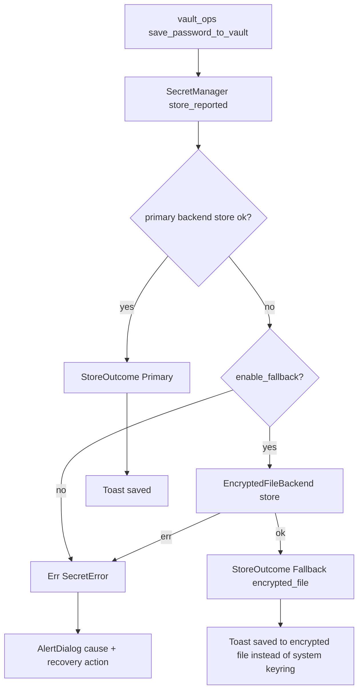

# Design Document

## Overview

This feature makes RustConn credential storage resilient on every supported
desktop, packaging format, platform, and architecture. It is delivered as three
incremental, independently shippable parts inside release **0.17.6**:

- **Part A — Diagnostics and graceful fallback.** Surface the real underlying
  error, replace the binary-presence check with a real Secret Service probe, and
  fall back to an application-managed encrypted store instead of silently losing
  a credential. Fixes the GitHub #201 user experience.
- **Part B — First-class application-managed encrypted-file backend.** A durable,
  desktop-environment-independent backend reusing RustConn's existing AES-256-GCM
  + Argon2id credential encryption. This is the safety net Part A falls back to.
- **Part C — Migrate the system-keyring path to the `oo7` crate.** Replace the
  `secret-tool` subprocess with an in-process, typed, async client. Quality and
  ecosystem alignment; must not regress macOS.

The guiding philosophy is *reuse before addition*. Part B is built almost
entirely from primitives already present in `rustconn-core` (`encrypt_credential`
/ `decrypt_credential_aes` / `get_machine_key`). Part A reshapes existing wiring
(`SecretManager`, `is_available`, the vault error dialog). Only Part C introduces
a new dependency (`oo7`), and most of its transitive dependencies (`zbus`,
`zvariant`, `aes`, `cbc`, `hkdf`, `pbkdf2`) are already in the lock file via
`ksni` and other crates.

### Mapping to requirements

| Requirement group | Part | Primary components touched |
|---|---|---|
| R1–R4 (diagnostics, probe, fallback, startup warn) | A | `SecretManager`, `LibSecretBackend`, `vault_ops.rs`, `app.rs` |
| R5–R8 (encrypted-file backend) | B | new `encrypted_file.rs`, `local_crypto.rs`, `SecretBackendType`, settings UI |
| R9–R13 (oo7 migration) | C | `libsecret.rs`, `keyring.rs`, `Cargo.toml`, Flatpak manifest |
| R14–R18 (cross-cutting) | A+B+C | error types, i18n/POT, packaging, tests |

## Architecture

### Current state (relevant slice)

```
rustconn (GUI)
  vault_ops.rs ── save/load orchestration, generic error dialog
  app.rs ─────── startup availability check (skips LibSecret)
  state/mod.rs ─ has_secret_backend() (5s timeout -> SecretManager::is_available)
  settings/secrets_tab ─ backend selector

rustconn-core
  secret/
    backend.rs ─── SecretBackend trait (store/retrieve/delete/is_available/...)
    manager.rs ─── SecretManager (priority list, cache, fallback wiring)
    libsecret.rs ─ shells out to `secret-tool` (Secret Service) [not(macos) use]
    keyring.rs ─── shared key-value via `secret-tool`
    macos_keychain.rs ─ security-framework backend [macos]
    resolver.rs ── CredentialResolver
  config/settings.rs ─ SecretBackendType, SecretSettings,
                       encrypt_credential / decrypt_credential_aes / get_machine_key
```

### Target state

```
rustconn-core/secret/
  backend.rs ─── SecretBackend trait + new `availability()` method (Part A)
  local_crypto.rs ─ NEW: shared AES-256-GCM + Argon2id + machine key (Part B)
                    (extracted from config/settings.rs; settings.rs delegates here)
  encrypted_file.rs ─ NEW: EncryptedFileBackend (Part B)
  libsecret.rs ─ oo7 in-process client [cfg(not(macos))] (Part C); real probe (Part A)
  keyring.rs ─── oo7 in-process key-value [cfg(not(macos))] (Part C)
  manager.rs ─── store() tries primary then encrypted-file fallback,
                 reports which backend stored (Part A)
config/settings.rs ─ SecretBackendType::EncryptedFile variant (Part B)
                     crypto fns delegate to local_crypto (Part B)
```

### Store flow with graceful fallback (Part A + B)



## Components and Interfaces

### Part A — Diagnostics and graceful fallback

#### A1. Structured availability on the `SecretBackend` trait (R2.5, R4.3)

`is_available() -> bool` cannot express the "client present but no Secret Service"
distinction. Add a non-breaking method with a default implementation:

```rust
// secret/backend.rs
/// Why a backend can or cannot currently store secrets.
#[derive(Debug, Clone, PartialEq, Eq)]
pub enum BackendAvailability {
    /// Backend is usable right now.
    Available,
    /// The client mechanism is missing (e.g. no oo7/secret-tool, no keychain).
    ClientMissing,
    /// Client is present but no Secret Service responds (the #201 case).
    ServiceUnavailable,
}

#[async_trait]
pub trait SecretBackend: Send + Sync {
    // ... existing methods unchanged ...

    /// Detailed availability. Default derives from `is_available()`.
    async fn availability(&self) -> BackendAvailability {
        if self.is_available().await {
            BackendAvailability::Available
        } else {
            BackendAvailability::ClientMissing
        }
    }
}
```

`is_available()` keeps its signature; backends that override `availability()`
implement `is_available()` as `self.availability().await == Available`.

#### A2. Real Secret Service probe in `LibSecretBackend` (R2.1–R2.5)

Replace the spawn-only check. Part A still uses `secret-tool`, so the probe runs a
read-only lookup of a sentinel attribute that is never stored:

```rust
async fn availability(&self) -> BackendAvailability {
    // 1. client present?
    if !secret_tool_on_path().await { return ClientMissing; }
    // 2. does a Secret Service answer? `lookup` of a non-existent key:
    //    exit 0 (found, unlikely) or exit 1 with EMPTY stderr  => service answered
    //    spawn ok but stderr mentions D-Bus / "Cannot autolaunch" /
    //    "org.freedesktop.secrets" / "No such secret collection" => ServiceUnavailable
    // ponytail: stderr heuristic; Part C replaces this with oo7's typed
    //           `Service::new()` error, which removes the string matching.
}
```

The probe is bounded by the existing 5-second `has_secret_backend` timeout
(R2.4); no new timeout is introduced. In **Part C** this method becomes a clean
`oo7::dbus::Service::new().await` — `Ok` => `Available`, the typed
`NotFound`/connection error => `ServiceUnavailable`.

#### A3. Fallback-on-store in `SecretManager` (R3.1–R3.4)

Two changes:

1. **Always register `EncryptedFileBackend` as the terminal fallback** when
   `enable_fallback` is set, in `build_from_settings`. It replaces the current
   "append LibSecret as fallback" logic for the cases where LibSecret itself is
   the failing primary (appending LibSecret as its own fallback is useless on the
   #201 box).
2. **`store_reported`** — a new method that attempts backends in priority order
   and reports which one succeeded:

```rust
pub enum StoreOutcome {
    Primary,                       // stored in the preferred backend
    Fallback { backend_id: &'static str }, // stored in a fallback (encrypted_file)
}

impl SecretManager {
    /// Stores via the preferred backend; on failure and when fallback is
    /// authorised, stores via the next backend that accepts the write.
    pub async fn store_reported(
        &self, connection_id: &str, creds: &Credentials, allow_fallback: bool,
    ) -> SecretResult<StoreOutcome> { /* ... */ }
}
```

`store()` keeps its existing `Result<()>` contract (delegates to
`store_reported` and discards the outcome) so other callers are untouched
(R14.3). When `allow_fallback` is false and the primary fails, the original error
is returned unchanged (R3.2).

#### A4. Actionable error dialog (R1.1–R1.5)

`vault_ops::show_vault_save_error_toast()` is renamed/extended to
`show_vault_save_error(err: &SecretError)` and:

- builds an `adw::AlertDialog` (HIG, blocking — a lost credential is critical),
- title `i18n("Password not saved")`,
- body combines the cause and a recovery action via `i18n_f`, where `cause` is
  the `SecretError` Display (already carries the real stderr / typed reason,
  secrets never enter it) and `recovery` is
  `i18n("No system keyring is responding. Open Settings then Secrets and choose Encrypted file or KeePassXC.")`,
- offers a `"settings"` response that opens Settings then Secrets (R1.5).

When `store_reported` returns `Fallback`, `vault_ops` instead shows a
non-blocking `adw::Toast`: `i18n("Saved to the encrypted file store because the
system keyring was unavailable.")` (R3.4).

#### A5. Startup + settings availability surfacing (R4.1–R4.4)

- `app.rs`: remove the `if matches!(backend, LibSecret) { return; }` early return
  so the default backend is also checked (R4.1). Use `availability()` to produce a
  precise warning: `ClientMissing` vs `ServiceUnavailable` get different
  `i18n_f` messages, both pointing to Settings then Secrets (R4.2).
- `secrets_tab`: show a per-backend availability indicator derived from
  `availability()` (R4.3): Available / "no keyring service" / "client missing".

### Part B — Encrypted-file backend

#### B1. Extract shared local crypto (`secret/local_crypto.rs`) (R5.2, R14.1)

The AES-256-GCM + Argon2id + machine-key code currently lives privately in
`config/settings.rs` (`encrypt_credential`, `decrypt_credential_aes`,
`derive_settings_key`, `get_machine_key`, the `RCSC` header constants). Move it to
`secret/local_crypto.rs` as `pub(crate)` functions and have `settings.rs` call
them. **The on-disk `RCSC` format and the machine-key file location are preserved
byte-for-byte** so existing `*_encrypted` config fields keep decoding (R14.1,
R14.3). This is a pure refactor verified by keeping the existing settings tests
green.

```rust
// secret/local_crypto.rs
pub(crate) fn machine_key() -> Zeroizing<Vec<u8>>;       // was get_machine_key
pub(crate) fn encrypt(plaintext: &[u8], key: &[u8]) -> Result<Vec<u8>, String>;
pub(crate) fn decrypt(data: &[u8], key: &[u8]) -> Result<Zeroizing<Vec<u8>>, String>;
```

#### B2. `EncryptedFileBackend` (R5, R6, R8)

New `secret/encrypted_file.rs` implementing `SecretBackend`:

- **Storage location (R6.2):** `dirs::data_dir()/rustconn/credentials.enc`. Inside
  Flatpak/Snap this resolves under `$XDG_DATA_HOME`, already writable with the
  permissions both sandboxes grant (no manifest change — R17.2). Distinct from
  `config.toml`, so it never collides with the `*_encrypted` master-secret fields
  (R6.4).
- **On-disk shape:** a JSON object `{ store_key: base64(RCSC blob) }`. Each value
  is an independently encrypted, serialized `Credentials` (R6.1, R6.5 — delete
  removes one key, leaves the rest). The file is written `0600` (R8.4) via a
  write-to-temp + `rename` to avoid truncation on crash.
- **Keying (R6.3):** addressed by the `connection_id` argument, which the GUI
  supplies as the `Store_Key` from `generate_store_key`. `EncryptedFile` uses the
  flat `rustconn/{name}` format (same branch as the non-LibSecret backends in
  `generate_store_key`), so store-time and resolve-time keys match.
- **`is_available` (R5.3):** `true` whenever `machine_key()` is non-empty; that
  holds on Linux, BSD, macOS, headless, and both sandboxes. Returns
  `ClientMissing` only in the pathological no-machine-key case.
- **`display_name` (R5.4):** `"Encrypted file — no system keyring required"`,
  wrapped in `i18n()` at the UI call site.
- **Secret hygiene (R8.1–R8.3, R8.6):** `Credentials` already holds
  `SecretString`; intermediate plaintext is `Zeroizing`; the struct holds no
  secret fields itself, and its `Debug` is derived over non-secret fields only,
  guarded by a leak test.

```rust
pub struct EncryptedFileBackend { path: PathBuf, app_id: String }

#[async_trait]
impl SecretBackend for EncryptedFileBackend {
    async fn store(&self, id: &str, c: &Credentials) -> SecretResult<()>;     // encrypt+merge+write 0600
    async fn retrieve(&self, id: &str) -> SecretResult<Option<Credentials>>;  // read+decrypt
    async fn delete(&self, id: &str) -> SecretResult<()>;                     // remove one key
    async fn is_available(&self) -> bool;                                     // machine key present
    fn backend_id(&self) -> &'static str { "encrypted_file" }
    fn display_name(&self) -> &'static str { "Encrypted file — no system keyring required" }
}
```

File I/O uses `tokio::task::spawn_blocking` (same pattern as
`MacOsKeychainBackend`) to keep the async contract without blocking the runtime.

#### B3. Selection, manager, resolver wiring (R7)

- `SecretBackendType::EncryptedFile` added **at the end** of the enum
  (`#[serde(rename_all="snake_case")]` => serialized `"encrypted_file"`), so older
  configs are unaffected and the new value round-trips (R14.3).
- `SecretManager::build_from_settings`: new match arm constructs
  `EncryptedFileBackend`; it is also the terminal fallback from A3.
- `resolver.rs` / `generate_store_key` / `select_backend_for_load`: treat
  `EncryptedFile` like the other flat-key backends.
- `secrets_tab`: append "Encrypted file (no system keyring)" to the backend
  `StringList` and extend the index/enum mapping (currently
  `0=KeePassXC,1=libsecret,2=Bitwarden,3=1Password,4=Passbolt,5=Pass`).

#### B4. Threat-model documentation (R8.5, R17.3)

`docs/ZERO_TRUST.md` (or a new `docs/SECRETS.md`) gains a section: the
EncryptedFile key (`~/.local/share/rustconn/.machine-key`, `0600`) rests on the
same machine as `credentials.enc`. It protects copied/backed-up config and
at-rest data, but a local attacker with read access to the data dir can decrypt.
A system keyring (or KeePassXC with a separate master password) offers stronger
protection where available. This is the explicit trade-off for guaranteed
cross-environment functionality.

### Part C — oo7 migration

#### C1. Dependency (R13)

```toml
# Cargo.toml [workspace.dependencies]
oo7 = { version = "0.4", default-features = false, features = ["tokio", "native_crypto", "tracing"] }
```

```toml
# rustconn-core/Cargo.toml — Linux/BSD only; never compiled on macOS (R10.2)
[target.'cfg(not(target_os = "macos"))'.dependencies]
oo7 = { workspace = true }
```

Version is pinned (R13.2). `cargo deny` is run after adding it (R13.1); `oo7` is
MIT and its crypto/zbus deps are already in the tree. The exact pinned minor is
chosen at implementation time against the then-current release; the manifest
records it.

#### C2. Replace `secret-tool` with in-process `oo7` (R9)

`libsecret.rs` and `keyring.rs` gain `#[cfg(not(target_os = "macos"))]`
implementations using `oo7::dbus::Service` (the DBus Secret Service backend,
**forced** rather than `oo7::Keyring::new()` auto-pick — see Design Decision 3).
Operations map directly: store => `Collection::create_item`, retrieve =>
`Collection::search_items`, delete => `Item::delete`.

Error mapping (R9.3):

| oo7 error | SecretError |
|---|---|
| service/connection unreachable | `BackendUnavailable` (-> `ServiceUnavailable`) |
| create/update failure | `StoreFailed` |
| search failure | `RetrieveFailed` |
| delete failure | `DeleteFailed` |
| other | `LibSecret` |

On macOS, `LibSecretBackend` is no longer constructed: `build_from_settings` is
adjusted so every arm that currently falls back to `LibSecretBackend::default_app()`
uses `MacOsKeychainBackend` under `#[cfg(target_os = "macos")]` (R10.1). This lets
`LibSecretBackend` and `keyring.rs`'s oo7 path be fully `cfg(not(macos))`,
guaranteeing `oo7` is absent from the macOS build (R10.2).

#### C3. Backward compatibility (R11)

The oo7 **DBus** backend reads/writes the *same* Secret Service with the *same
attributes and labels* RustConn already uses (`application=rustconn`,
`connection_id`, `key`, label `RustConn: {id}`). Entries written by the old
`secret-tool` path are therefore retrieved unchanged (R11.1, R11.3). No data
migration is required for the common path; the `oo7::migrate` helper is noted as a
future option for users who later opt into the sandbox file backend (R11.2) and is
out of scope for forcing in 0.17.6.

#### C4. Packaging (R12, R17)

- **Flatpak** (`packaging/flathub/...yml`, `packaging/flatpak/...yml`,
  `...local.yml`): remove the entire `libsecret` build module — oo7 is pure Rust
  and talks D-Bus directly, so neither the C library nor `secret-tool` needs
  bundling (R12.1). **Retain** `--talk-name=org.freedesktop.secrets`,
  `org.kde.kwalletd5/6` (R12.3); the Secret portal is reachable without extra
  finish-args if the file backend is ever enabled.
- **Snap/Debian**: no actual `secret-tool` package dependency exists today (only
  description prose mentions libsecret); update the prose and confirm no runtime
  dep (R12.2).
- These removals happen **only in Part C** (R12.4); Parts A and B ship with the
  manifest unchanged (R17.1).

## Data Models

### `credentials.enc` (Part B)

```jsonc
// $XDG_DATA_HOME/rustconn/credentials.enc, mode 0600
{
  "rustconn/Prod Web": "UkNTQwE...base64 RCSC blob...",
  "rustconn/db-01":    "UkNTQwE..."
}
```

Each blob = existing `RCSC` v1 format: `RCSC`(4) + version(1) + salt(16) +
nonce(12) + ciphertext + tag(16), where plaintext is `serde_json` of:

```rust
struct StoredCredentials {       // plaintext only inside Zeroizing, never logged
    username: Option<String>,
    password: Option<String>,
    key_passphrase: Option<String>,
    domain: Option<String>,
}
```

### `SecretBackendType` (Part B)

Existing variants unchanged; append `EncryptedFile` => `"encrypted_file"`.

## Error Handling

- No new `SecretError` variants are required; existing variants carry the real
  cause and are reused. `BackendUnavailable` is the signal mapped to
  `ServiceUnavailable` in `availability()`.
- All error text routed through `i18n`/`i18n_f` at the GUI boundary (R16.1);
  `SecretError` Display strings remain English/log-side and never contain secrets
  (R1.4, R8.3).
- `EncryptedFileBackend` maps crypto/IO failures to `StoreFailed` /
  `RetrieveFailed` / `DeleteFailed` with no secret material in the message.
- macOS path and all other backends keep their current error behavior (R10.1).

## Testing Strategy

`rustconn-core` only (GUI-free), respecting the test policy:

- **Round-trip property test** (R18.1, R5.5): for arbitrary `Credentials`,
  `EncryptedFileBackend::store` then `retrieve` yields an equivalent credential.
  Uses a temp data dir; added to `rustconn-core/tests/property_tests`.
- **Debug-leak tests** (R18.2, R8.6): for `EncryptedFileBackend`,
  `StoredCredentials`, and any new secret-holding type, assert the `Debug` string
  excludes a sentinel password.
- **Availability distinction test** (R18.3): a unit test asserts that the probe
  result type distinguishes `ClientMissing`, `ServiceUnavailable`, and
  `Available` (the heuristic/classifier is pure and testable without a live
  D-Bus).
- **`local_crypto` regression**: an explicit test that a blob produced by the
  pre-refactor format still decrypts (guards R14.1).
- **`store_reported` fallback test**: with a stub primary backend that always
  errors and an `EncryptedFileBackend`, assert the outcome is
  `Fallback { "encrypted_file" }` and the credential is retrievable.
- Per-part `cargo deny` run after Part C (R13.1).
- Quality gate via the `rust-quality-check` sub-agent (fmt + clippy + tests) at
  the end of each part.

## Design Decisions and Rationale

1. **Part B reuses the existing AES-256-GCM/Argon2id code rather than adding a
   crate.** Lazy-senior rung 4 ("a present dependency solves it"): `ring` +
   `argon2` + the `RCSC` format are already implemented and tested. Extracting
   them to `local_crypto.rs` removes duplication and keeps one audited code path.

2. **`EncryptedFileBackend` is the single graceful-fallback target, not
   LibSecret.** On the #201 system LibSecret is the failing primary, so appending
   it as its own fallback is meaningless. The encrypted file works in every
   environment, making it the only sound terminal fallback.

3. **Part C forces oo7's DBus backend instead of `Keyring::new()` auto-pick.**
   Auto-pick would use the sandbox file backend via `org.freedesktop.portal.Secret`,
   whose only implementation is gnome-keyring — so it neither helps the
   KDE-without-keyring case nor preserves existing entry locations, and it would
   require a data migration. Forcing the DBus backend keeps byte-compatible
   entries (seamless upgrade) while Part B + Part A cover the no-service case.
   Auto-pick/portal remains a documented future option.

4. **`availability()` added as a default-method trait extension, not a breaking
   signature change.** Keeps all existing backends compiling unchanged; only
   `LibSecretBackend` overrides it.

5. **macOS never compiles `oo7`.** `build_from_settings` routes all
   non-keychain arms to `MacOsKeychainBackend` on macOS, allowing
   `LibSecretBackend`/`keyring.rs` to be fully `cfg(not(macos))`.

## Packaging Matrix Summary

| Format | Part A | Part B | Part C |
|---|---|---|---|
| Flatpak | unchanged | unchanged (data dir already writable) | drop `libsecret` module; keep secrets/kwallet talk-names |
| Snap | unchanged | unchanged | update description prose only |
| Debian | unchanged | unchanged | update description prose only |
| macOS .app/.dmg | unchanged | EncryptedFile available | `oo7` not compiled; Keychain unchanged |
