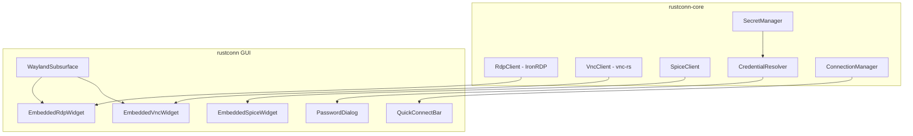

# Design Document: Native Protocol Embedding

## Overview

This design document describes the implementation of native embedded RDP protocol support using IronRDP, along with improvements to credential management, connection naming, SSH key handling, external mode enhancements, Quick Connect, Wayland subsurface integration, and SPICE protocol support.

The architecture follows the existing VNC client pattern (vnc-rs) to ensure consistency and maintainability. The core principle is separation of concerns: protocol clients live in `rustconn-core`, while GUI integration lives in `rustconn`.

## Architecture



## Components and Interfaces

### 1. RDP Client (IronRDP Integration)

**Location:** `rustconn-core/src/rdp_client/`

The RDP client follows the same pattern as the VNC client:

```rust
// rustconn-core/src/rdp_client/client.rs
pub struct RdpClient {
    command_tx: Option<std::sync::mpsc::Sender<RdpClientCommand>>,
    event_rx: Option<std::sync::mpsc::Receiver<RdpClientEvent>>,
    connected: Arc<AtomicBool>,
    config: RdpClientConfig,
}

impl RdpClient {
    pub fn new(config: RdpClientConfig) -> Self;
    pub fn connect(&mut self) -> Result<(), RdpClientError>;
    pub fn disconnect(&mut self);
    pub fn try_recv_event(&self) -> Option<RdpClientEvent>;
    pub fn send_command(&self, cmd: RdpClientCommand) -> Result<(), RdpClientError>;
    pub fn send_key(&self, scancode: u16, pressed: bool) -> Result<(), RdpClientError>;
    pub fn send_pointer(&self, x: u16, y: u16, buttons: u8) -> Result<(), RdpClientError>;
    pub fn send_ctrl_alt_del(&self) -> Result<(), RdpClientError>;
    pub fn is_connected(&self) -> bool;
}
```

**Events and Commands:**

```rust
pub enum RdpClientEvent {
    Connected,
    Disconnected,
    ResolutionChanged { width: u32, height: u32 },
    FrameUpdate { rect: RdpRect, data: Vec<u8> },
    CursorUpdate { rect: RdpRect, data: Vec<u8> },
    Error(String),
    AuthenticationRequired,
}

pub enum RdpClientCommand {
    Disconnect,
    KeyEvent { scancode: u16, pressed: bool },
    PointerEvent { x: u16, y: u16, buttons: u8 },
    SetDesktopSize { width: u16, height: u16 },
    SendCtrlAltDel,
    Authenticate { username: String, password: String, domain: Option<String> },
}
```

### 2. Credential Resolution Enhancement

**Location:** `rustconn-core/src/secret/resolver.rs`

Enhanced credential resolver with verification tracking:

```rust
pub struct CredentialResolver {
    secret_manager: Arc<SecretManager>,
    settings: SecretSettings,
}

impl CredentialResolver {
    /// Resolves credentials with verification status check
    pub async fn resolve_verified(&self, connection: &Connection) -> SecretResult<Option<VerifiedCredentials>>;
    
    /// Marks credentials as verified after successful use
    pub async fn mark_verified(&self, connection: &Connection) -> SecretResult<()>;
    
    /// Marks credentials as requiring re-verification
    pub async fn mark_unverified(&self, connection: &Connection) -> SecretResult<()>;
    
    /// Determines the best storage backend
    pub fn select_storage_backend(&self) -> CredentialBackend;
    
    /// Migrates credentials from Keyring to KeePass
    pub async fn migrate_to_keepass(&self, connection: &Connection) -> SecretResult<()>;
    
    /// Checks if Keyring is available
    pub fn is_keyring_available(&self) -> bool;
    
    /// Checks if credentials exist in Keyring but not KeePass
    pub async fn needs_keepass_migration(&self, connection: &Connection) -> SecretResult<bool>;
}

pub struct VerifiedCredentials {
    pub credentials: Credentials,
    pub verified: bool,
    pub last_verified: Option<DateTime<Utc>>,
}

pub enum CredentialBackend {
    KeePass,
    Keyring,
    None,
}
```

### 3. Connection Naming

**Location:** `rustconn-core/src/connection/manager.rs`

```rust
impl ConnectionManager {
    /// Generates a unique name for a connection
    pub fn generate_unique_name(&self, base_name: &str, protocol: ProtocolType) -> String;
    
    /// Checks if a name needs deduplication
    pub fn needs_deduplication(&self, name: &str, exclude_id: Option<Uuid>) -> bool;
    
    /// Removes auto-generated suffix if name is now unique
    pub fn normalize_name(&self, name: &str) -> String;
}
```

**Naming Algorithm:**
1. Check if `base_name` exists
2. If exists with different protocol: append ` (PROTOCOL)`
3. If still exists: append numeric suffix ` 2`, ` 3`, etc.

### 4. SSH Key Selection

**Location:** `rustconn-core/src/protocol/ssh.rs`

```rust
impl SshProtocol {
    /// Builds SSH command arguments with proper key handling
    pub fn build_command_args(&self, connection: &Connection) -> Vec<String> {
        let mut args = Vec::new();
        
        match &connection.protocol_config {
            ProtocolConfig::Ssh(ssh_config) => {
                match ssh_config.auth_method {
                    SshAuthMethod::File => {
                        if let Some(key_path) = &ssh_config.key_file {
                            args.push("-i".to_string());
                            args.push(key_path.clone());
                            args.push("-o".to_string());
                            args.push("IdentitiesOnly=yes".to_string());
                        }
                    }
                    SshAuthMethod::Agent => {
                        // No IdentitiesOnly - allow agent to provide keys
                    }
                    _ => {}
                }
            }
            _ => {}
        }
        
        args
    }
}
```

### 5. External Mode Improvements

**Location:** `rustconn/src/embedded_rdp.rs`

```rust
impl SafeFreeRdpLauncher {
    fn add_connection_args(cmd: &mut Command, config: &RdpConfig) {
        // ... existing args ...
        
        // Add decorations for window controls
        cmd.arg("/decorations");
        
        // Add window geometry if saved
        if let Some(geometry) = &config.window_geometry {
            cmd.arg(format!("/x:{}", geometry.x));
            cmd.arg(format!("/y:{}", geometry.y));
        }
    }
}
```

**Window Geometry Persistence:**

```rust
// rustconn-core/src/models/connection.rs
pub struct WindowGeometry {
    pub x: i32,
    pub y: i32,
    pub width: u32,
    pub height: u32,
}

impl Connection {
    pub remember_window_position: bool,
    pub window_geometry: Option<WindowGeometry>,
}
```

### 6. Quick Connect

**Location:** `rustconn/src/quick_connect.rs`

```rust
pub struct QuickConnectBar {
    entry: Entry,
    protocol_dropdown: DropDown,
    connect_button: Button,
}

impl QuickConnectBar {
    pub fn new() -> Self;
    
    /// Creates a temporary connection for Quick Connect
    pub fn create_temp_connection(&self) -> Connection {
        Connection {
            id: Uuid::new_v4(),
            name: format!("Quick: {}", self.get_host()),
            host: self.get_host(),
            protocol: self.get_protocol(),
            // ... minimal config ...
        }
    }
}
```

### 7. Wayland Subsurface Integration

**Location:** `rustconn/src/wayland_surface.rs`

```rust
pub struct WaylandSubsurface {
    surface: Option<wl_surface::WlSurface>,
    subsurface: Option<wl_subsurface::WlSubsurface>,
    shm_pool: Option<ShmPool>,
    buffer: Option<wl_buffer::WlBuffer>,
    width: u32,
    height: u32,
}

impl WaylandSubsurface {
    pub fn new() -> Self;
    pub fn initialize(&mut self, parent: &impl IsA<gtk4::Widget>) -> Result<(), WaylandError>;
    pub fn update_position(&self, x: i32, y: i32);
    pub fn blit_framebuffer(&mut self, data: &[u8], rect: &Rect);
    pub fn commit(&self);
    pub fn cleanup(&mut self);
}
```

### 8. SPICE Protocol

**Location:** `rustconn-core/src/spice_client/`

```rust
pub struct SpiceClient {
    // Similar structure to VNC/RDP clients
    command_tx: Option<std::sync::mpsc::Sender<SpiceClientCommand>>,
    event_rx: Option<std::sync::mpsc::Receiver<SpiceClientEvent>>,
    connected: Arc<AtomicBool>,
    config: SpiceClientConfig,
}

// Fallback to virt-viewer if native client unavailable
pub fn detect_spice_viewer() -> Option<String> {
    let candidates = ["remote-viewer", "virt-viewer", "spicy"];
    // ... detection logic ...
}
```

## Data Models

### RDP Client Configuration

```rust
#[derive(Debug, Clone, Serialize, Deserialize)]
pub struct RdpClientConfig {
    pub host: String,
    pub port: u16,
    pub username: Option<String>,
    pub domain: Option<String>,
    pub width: u32,
    pub height: u32,
    pub color_depth: u8,
    pub clipboard_enabled: bool,
    pub audio_enabled: bool,
    pub drive_redirection: Vec<DriveRedirection>,
    pub security_protocol: RdpSecurityProtocol,
}

#[derive(Debug, Clone, Serialize, Deserialize)]
pub enum RdpSecurityProtocol {
    Auto,
    Rdp,
    Tls,
    Nla,
    Ext,
}
```

### Credential Verification Status

```rust
#[derive(Debug, Clone, Serialize, Deserialize)]
pub struct CredentialStatus {
    pub connection_id: Uuid,
    pub verified: bool,
    pub last_verified: Option<DateTime<Utc>>,
    pub failure_count: u32,
}
```

## Correctness Properties

*A property is a characteristic or behavior that should hold true across all valid executions of a system-essentially, a formal statement about what the system should do. Properties serve as the bridge between human-readable specifications and machine-verifiable correctness guarantees.*

### Property 1: RDP Framebuffer Event Conversion
*For any* RDP framebuffer update received from IronRDP, the system should convert it to a consistent event format with valid rect coordinates and pixel data.
**Validates: Requirements 1.1, 10.3**

### Property 2: Mouse Coordinate Transformation
*For any* widget coordinates (x, y) within the embedded RDP widget bounds, the transformation to RDP server coordinates should produce valid coordinates within the RDP framebuffer dimensions.
**Validates: Requirements 1.2**

### Property 3: Key Event Forwarding
*For any* GTK key event with a valid keyval, the system should produce a corresponding RDP scancode that can be sent to the server.
**Validates: Requirements 1.3**

### Property 4: Resource Cleanup on Disconnect
*For any* connected RDP session, after disconnect is called, all IronRDP resources should be released and the client should report disconnected state.
**Validates: Requirements 1.6**

### Property 5: Resize Request Generation
*For any* resize event on the embedded RDP widget, the system should generate a resolution change request with dimensions that fit within standard RDP resolution limits.
**Validates: Requirements 1.7**

### Property 6: Verified Credentials Skip Dialog
*For any* connection with credentials marked as verified, the credential resolution should return the credentials without requiring user interaction.
**Validates: Requirements 2.1**

### Property 7: Missing Credentials Require Dialog
*For any* connection without saved credentials, the credential resolution should return None, indicating dialog is needed.
**Validates: Requirements 2.2**

### Property 8: Dialog Pre-fill from Connection
*For any* connection with saved username and domain, the password dialog should be pre-filled with those values.
**Validates: Requirements 2.4**

### Property 9: Successful Auth Marks Verified
*For any* successful authentication, the credentials should be marked as verified with a timestamp.
**Validates: Requirements 2.5**

### Property 10: Backend Selection Priority
*For any* credential save request, if KeePass is enabled the credentials should be stored in KeePass, otherwise in Keyring.
**Validates: Requirements 3.1**

### Property 11: Keyring Fallback When KeePass Empty
*For any* credential lookup where KeePass is enabled but credentials only exist in Keyring, the Keyring credentials should be returned.
**Validates: Requirements 3.2**

### Property 12: Migration Button Visibility
*For any* connection where KeePass is enabled and credentials exist in Keyring but not KeePass, the "Save to KeePass" button should be visible.
**Validates: Requirements 3.3**

### Property 13: Connection Name Deduplication
*For any* new connection with a name that already exists, the generated name should include a protocol suffix and be unique among all connections.
**Validates: Requirements 4.1, 4.2**

### Property 14: Name Suffix Removal
*For any* connection rename to a unique name, any auto-generated suffix should be removed from the final name.
**Validates: Requirements 4.3**

### Property 15: SSH Key File Flag Generation
*For any* SSH connection with File authentication method and a key file path, the generated command should include `-i <path>` and `-o IdentitiesOnly=yes`.
**Validates: Requirements 5.1, 5.2**

### Property 16: SSH Agent No IdentitiesOnly
*For any* SSH connection with Agent authentication method, the generated command should NOT include `-o IdentitiesOnly=yes`.
**Validates: Requirements 5.3**

### Property 17: FreeRDP Decorations Flag
*For any* FreeRDP external mode launch, the command should include the `/decorations` flag.
**Validates: Requirements 6.1**

### Property 18: Window Geometry Restoration
*For any* connection with saved window geometry and remember_window_position enabled, the restored geometry should match the saved values.
**Validates: Requirements 6.3**

### Property 19: Disabled Position Memory
*For any* connection with remember_window_position disabled, no window geometry should be applied to the launch command.
**Validates: Requirements 6.4**

### Property 20: Quick Connect No Persistence
*For any* Quick Connect session, after the session ends the connection should not appear in the saved connections list.
**Validates: Requirements 7.4**

### Property 21: RDP Config Round-Trip Serialization
*For any* valid RdpClientConfig, serializing to JSON and deserializing should produce an equivalent configuration.
**Validates: Requirements 10.4**

## Error Handling

### RDP Client Errors

```rust
#[derive(Debug, Error)]
pub enum RdpClientError {
    #[error("Connection failed: {0}")]
    ConnectionFailed(String),
    
    #[error("Authentication failed: {0}")]
    AuthenticationFailed(String),
    
    #[error("Protocol error: {0}")]
    ProtocolError(String),
    
    #[error("IronRDP not available, falling back to FreeRDP")]
    IronRdpNotAvailable,
    
    #[error("Channel communication error: {0}")]
    ChannelError(String),
    
    #[error("Already connected")]
    AlreadyConnected,
    
    #[error("Not connected")]
    NotConnected,
}
```

### Credential Errors

```rust
#[derive(Debug, Error)]
pub enum CredentialError {
    #[error("Keyring unavailable: {0}")]
    KeyringUnavailable(String),
    
    #[error("KeePass database locked")]
    KeePassLocked,
    
    #[error("Credential not found")]
    NotFound,
    
    #[error("Migration failed: {0}")]
    MigrationFailed(String),
}
```

## Testing Strategy

### Property-Based Testing Framework

The project uses `proptest` for property-based testing. All property tests should be placed in `rustconn-core/tests/properties/`.

### Unit Tests

Unit tests cover:
- Specific examples demonstrating correct behavior
- Edge cases (empty inputs, boundary values)
- Error conditions and fallback paths

### Property-Based Tests

Property tests verify:
- Coordinate transformation correctness
- Event conversion consistency
- Serialization round-trips
- Name deduplication algorithm
- SSH command generation
- Credential resolution logic

Each property test should:
1. Run a minimum of 100 iterations
2. Be tagged with the property number and requirements reference
3. Use smart generators that constrain to valid input spaces

**Test File Structure:**

```
rustconn-core/tests/properties/
├── rdp_client_tests.rs      # Properties 1-5, 21
├── credential_tests.rs      # Properties 6-12
├── connection_naming_tests.rs # Properties 13-14
├── ssh_command_tests.rs     # Properties 15-16
├── external_mode_tests.rs   # Properties 17-19
└── quick_connect_tests.rs   # Property 20
```

### Integration Tests

Integration tests verify:
- Full connection flow with mock servers
- Credential storage and retrieval
- Window geometry persistence
