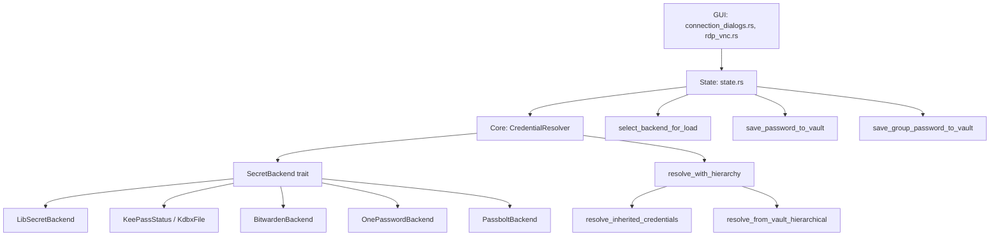

# Дизайн: Виправлення управління секретами

## Огляд

Цей документ описує технічний дизайн п'яти виправлень у підсистемі управління секретами RustConn. Всі зміни стосуються існуючого коду — нових модулів не створюється. Основна мета: забезпечити коректну диспетчеризацію бекендів, узгодити формати ключів для Inherit, додати автоматичне розблокування при старті та зберігання паролів при підключенні з джерелом Vault.

## Архітектура

Поточна архітектура секретів має три рівні:



Виправлення торкаються рівнів GUI та State (крейт `rustconn`) і Core (крейт `rustconn-core`).

## Компоненти та інтерфейси

### Виправлення 1: Диспетчеризація бекенду в connection_dialogs.rs

**Файл:** `rustconn/src/window/connection_dialogs.rs` ~рядок 433

**Проблема:** Гілка `else` (коли `!kdbx_enabled`) завжди створює `LibSecretBackend::new("rustconn")` замість диспетчеризації через `select_backend_for_load`.

**Рішення:** Замінити захардкоджений `LibSecretBackend` на диспетчеризацію аналогічну `save_group_password_to_vault`:

```rust
// БУЛО:
let backend = rustconn_core::secret::LibSecretBackend::new("rustconn");
crate::async_utils::with_runtime(|rt| {
    rt.block_on(backend.retrieve(&lookup_key))
        .map_err(|e| format!("{e}"))
})?

// СТАЛО:
let backend_type = crate::state::select_backend_for_load(&secret_settings);
match backend_type {
    SecretBackendType::Bitwarden => {
        crate::async_utils::with_runtime(|rt| {
            let backend = rt.block_on(rustconn_core::secret::auto_unlock(&secret_settings))
                .map_err(|e| format!("{e}"))?;
            rt.block_on(backend.retrieve(&lookup_key))
                .map_err(|e| format!("{e}"))
        })?
    }
    SecretBackendType::OnePassword => {
        let backend = rustconn_core::secret::OnePasswordBackend::new();
        crate::async_utils::with_runtime(|rt| {
            rt.block_on(backend.retrieve(&lookup_key))
                .map_err(|e| format!("{e}"))
        })?
    }
    SecretBackendType::Passbolt => {
        let backend = rustconn_core::secret::PassboltBackend::new();
        crate::async_utils::with_runtime(|rt| {
            rt.block_on(backend.retrieve(&lookup_key))
                .map_err(|e| format!("{e}"))
        })?
    }
    _ => {
        let backend = rustconn_core::secret::LibSecretBackend::new("rustconn");
        crate::async_utils::with_runtime(|rt| {
            rt.block_on(backend.retrieve(&lookup_key))
                .map_err(|e| format!("{e}"))
        })?
    }
}
```

### Виправлення 2: Автоматичне розблокування Bitwarden при старті

**Файл:** `rustconn/src/state.rs`, функція `AppState::new()` ~рядок 190

**Проблема:** `AppState::new()` розшифровує лише пароль KeePass (`decrypt_password()`). Пароль Bitwarden (`bitwarden_password_encrypted`) не розшифровується, і `auto_unlock` не викликається.

**Рішення:** Додати після блоку валідації KDBX:

```rust
// Розшифрувати пароль Bitwarden при старті (Виправлення 5)
if settings.secrets.bitwarden_password_encrypted.is_some() {
    if settings.secrets.decrypt_bitwarden_password() {
        tracing::info!("Bitwarden password restored from encrypted storage");
    } else {
        tracing::warn!("Failed to decrypt Bitwarden password");
    }
}

// Автоматичне розблокування Bitwarden при старті (Виправлення 2)
if matches!(
    settings.secrets.preferred_backend,
    SecretBackendType::Bitwarden
) {
    match crate::async_utils::with_runtime(|rt| {
        rt.block_on(rustconn_core::secret::auto_unlock(&settings.secrets))
    }) {
        Ok(_backend) => {
            tracing::info!("Bitwarden vault unlocked at startup");
        }
        Err(e) => {
            tracing::warn!("Bitwarden auto-unlock at startup failed: {e}");
        }
    }
}
```

Це об'єднує Виправлення 2 і 5 — спочатку розшифровуємо пароль, потім використовуємо його для `auto_unlock`. Функція `auto_unlock` вже встановлює `BW_SESSION` через `std::env::set_var`.

### Виправлення 3: Узгодження ключів для Inherit

**Файли:**
- `rustconn-core/src/secret/resolver.rs`, функція `resolve_inherited_credentials` ~рядок 1041
- `rustconn/src/state.rs`, функція `resolve_credentials_blocking` ~рядок 1276

**Проблема:** Є два шляхи для Inherit:
1. `resolve_credentials_blocking` (state.rs) — обробляє Inherit лише для KeePass (`if kdbx_enabled`)
2. `resolve_inherited_credentials` (resolver.rs) — для не-KeePass бекендів шукає по `group.id.to_string()`

При цьому `save_group_password_to_vault` зберігає по `lookup_key` (який передається ззовні). Потрібно перевірити, що `lookup_key` при збереженні = `group.id.to_string()` при читанні.

**Аналіз викликів збереження:**

В `connection_dialogs.rs` ~рядок 623 та `edit_dialogs.rs` ~рядок 961:
```rust
let group_path = format!("RustConn/Groups/{}", group_name);
// ...
crate::state::save_group_password_to_vault(
    &settings,
    &group_path,   // для KeePass
    &lookup_key,   // для не-KeePass — це group.id.to_string()? Потрібно перевірити
    &username,
    &password,
);
```

**Рішення:** Два підходи:

**Підхід A (обраний):** Уніфікувати `resolve_credentials_blocking` для не-KeePass бекендів — додати обробку Inherit аналогічно KeePass гілці, але з використанням `select_backend_for_load` та відповідного бекенду. Ключ пошуку — `group.id.to_string()`.

Також потрібно переконатися, що при збереженні групового пароля для не-KeePass бекендів використовується `group.id.to_string()` як `lookup_key`.

```rust
// В resolve_credentials_blocking, після блоку KeePass Inherit:
// Додати обробку Inherit для не-KeePass бекендів
if connection.password_source == PasswordSource::Inherit && !kdbx_enabled {
    let backend_type = select_backend_for_load(&secret_settings);
    let mut current_group_id = connection.group_id;
    
    while let Some(group_id) = current_group_id {
        let Some(group) = groups.iter().find(|g| g.id == group_id) else {
            break;
        };
        
        if group.password_source == Some(PasswordSource::Vault) {
            let group_key = group.id.to_string();
            // Dispatch to correct backend using group_key
            match load_from_backend(backend_type, &group_key, &secret_settings) {
                Ok(Some(creds)) => return Ok(Some(merge_group_credentials(creds, group))),
                Ok(None) => {}
                Err(e) => tracing::warn!("Inherit lookup failed for group '{}': {e}", group.name),
            }
        } else if group.password_source == Some(PasswordSource::Inherit) {
            // continue to parent
        }
        
        current_group_id = group.parent_id;
    }
}
```

### Виправлення 4: Збереження пароля при підключенні з Vault

**Файл:** `rustconn/src/window/rdp_vnc.rs` ~рядок 107 (та аналогічні місця для SSH, VNC)

**Проблема:** Пароль зберігається у Vault лише якщо `creds.save_credentials == true`. Але якщо `password_source == Vault` і пароль не знайдено — користувач вводить пароль через діалог, і він не зберігається автоматично.

**Рішення:** Додати перевірку `password_source` перед перевіркою `save_credentials`:

```rust
if let Some(creds) = result {
    // Визначити чи потрібно зберігати
    let should_save = creds.save_credentials || {
        // Автоматично зберігати якщо джерело = Vault
        let state_ref = state.borrow();
        state_ref
            .get_connection(connection_id)
            .map(|c| c.password_source == PasswordSource::Vault)
            .unwrap_or(false)
    };
    
    if should_save {
        // ... існуючий код збереження ...
    }
    // ... решта коду ...
}
```

### Виправлення 5: Розшифрування пароля Bitwarden при старті

Об'єднано з Виправленням 2 (див. вище). Виклик `decrypt_bitwarden_password()` додається в `AppState::new()` перед `auto_unlock`.


## Моделі даних

Нових моделей даних не створюється. Використовуються існуючі:

- `PasswordSource` — enum (Vault, Prompt, Variable, Inherit, None)
- `SecretBackendType` — enum (KeePassXc, KdbxFile, LibSecret, Bitwarden, OnePassword, Passbolt)
- `SecretSettings` — структура налаштувань секретів з полями для кожного бекенду
- `Credentials` — структура з username, password (SecretString), key_passphrase, domain
- `ConnectionGroup` — структура групи з id (Uuid), password_source, username, domain
- `Connection` — структура з'єднання з password_source, group_id

Ключова зміна в моделі даних — уніфікація формату `lookup_key` для групових паролів:
- KeePass: `RustConn/Groups/{group_name}` (ієрархічний шлях)
- Не-KeePass бекенди: `group.id.to_string()` (UUID групи)

## Властивості коректності

*Властивість коректності — це характеристика або поведінка, яка повинна бути істинною для всіх валідних виконань системи. Властивості служать мостом між людино-читабельними специфікаціями та машинно-верифікованими гарантіями коректності.*

### Property 1: Узгодженість lookup_key для групових паролів (round-trip)

*Для будь-якої* групи `ConnectionGroup` та не-KeePass бекенду, lookup_key що використовується при збереженні пароля групи через `save_group_password_to_vault` повинен дорівнювати lookup_key що використовується при читанні через `resolve_inherited_credentials`.

**Validates: Requirements 3.1, 3.2, 3.3**

### Property 2: Обхід ієрархії при Inherit

*Для будь-якої* ієрархії груп де з'єднання має `PasswordSource::Inherit`, і деякі проміжні групи також мають `Inherit`, а одна з батьківських груп має `PasswordSource::Vault` з збереженим паролем — `resolve_inherited_credentials` повинен знайти пароль цієї батьківської групи, пропускаючи проміжні Inherit групи.

**Validates: Requirements 3.4**

### Property 3: Об'єднання облікових даних групи

*Для будь-якої* групи з встановленими `username` та/або `domain`, і будь-яких знайдених `Credentials` з паролем — результат `merge_group_credentials` повинен містити пароль з `Credentials` та username/domain з групи (якщо вони не встановлені в `Credentials`).

**Validates: Requirements 3.5**

### Property 4: Round-trip шифрування/розшифрування пароля Bitwarden

*Для будь-якого* валідного пароля (непорожній рядок), шифрування через `encrypt_bitwarden_password` з подальшим розшифруванням через `decrypt_bitwarden_password` повинно повернути оригінальний пароль.

**Validates: Requirements 5.2**

## Обробка помилок

Відповідно до правил продукту RustConn, використовується дворівневий підхід:

| Ситуація | Користувач (Toast) | Лог (tracing) |
|----------|-------------------|---------------|
| Бекенд недоступний при Load from Vault | "Secret backend unavailable" | `tracing::error!(?error, "Backend {} unavailable", backend_id)` |
| Помилка збереження пароля у Vault | "Failed to save password to vault" | `tracing::error!("Failed to save password: {e}")` |
| Bitwarden auto_unlock невдалий при старті | Без Toast (тихий fallback) | `tracing::warn!("Bitwarden auto-unlock failed: {e}")` |
| Розшифрування пароля Bitwarden невдале | Без Toast (тихий fallback) | `tracing::warn!("Failed to decrypt Bitwarden password")` |
| Inherit — пароль не знайдено в ієрархії | Діалог введення пароля | `tracing::debug!("No inherited credentials found")` |

Правила:
- Toast повідомлення до 60 символів, без технічних деталей
- Помилки при старті не блокують ініціалізацію — graceful degradation
- Всі помилки секретів логуються через `tracing` з повними деталями

## Стратегія тестування

### Property-based тести (proptest)

Бібліотека: `proptest` 1.6 (вже є в dev-dependencies `rustconn-core`)

Розташування: `rustconn-core/tests/properties/secret_fixes_tests.rs`
Реєстрація: додати `mod secret_fixes_tests;` в `rustconn-core/tests/properties/mod.rs`

Кожен property тест повинен виконуватись мінімум 100 ітерацій.

| Property | Тест | Генератор |
|----------|------|-----------|
| 1: Lookup key consistency | Генерувати випадкові `ConnectionGroup` з UUID, перевірити що save key == resolve key | `proptest::arbitrary` для String (name), Uuid |
| 2: Hierarchy traversal | Генерувати ієрархію груп (1-5 рівнів) з різними PasswordSource, перевірити що Inherit доходить до Vault | Кастомний генератор ієрархії |
| 3: Group credentials merge | Генерувати Credentials та ConnectionGroup з різними комбінаціями username/domain | `proptest::arbitrary` для Option<String> |
| 4: BW password round-trip | Генерувати випадкові паролі, encrypt → decrypt | `proptest::string::string_regex` для паролів |

### Unit тести

Unit тести доповнюють property тести для конкретних edge cases:

- `select_backend_for_load` повертає правильний тип для кожного `preferred_backend`
- `merge_group_credentials` з порожніми Credentials
- `resolve_inherited_credentials` з порожньою ієрархією (немає груп)
- `resolve_inherited_credentials` з групою без password_source

### Формат тегів

Кожен property тест повинен мати коментар:
```rust
// Feature: secrets-management-fixes, Property N: {property_text}
```

### Команди запуску

```bash
cargo test -p rustconn-core --test property_tests    # Всі property тести
cargo test -p rustconn-core --test property_tests secret_fixes  # Тільки ці тести
```
