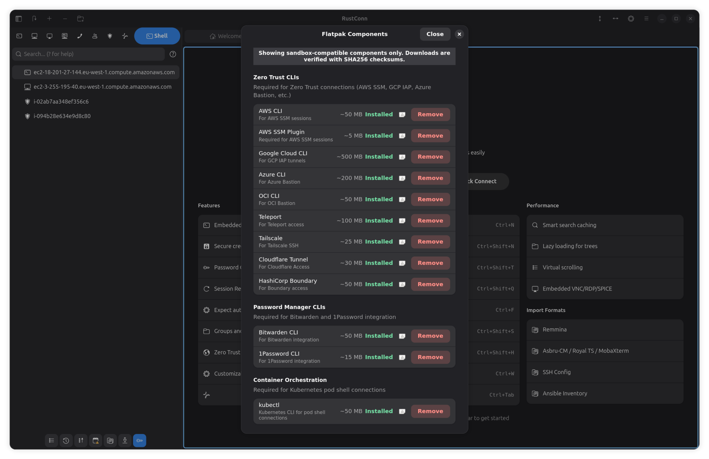

# RustConn User Guide

**Version 0.8.5** | GTK4/libadwaita Connection Manager for Linux

RustConn is a modern connection manager designed for Linux with Wayland-first approach. It supports SSH, RDP, VNC, SPICE, SFTP, Telnet, Serial, Kubernetes protocols and Zero Trust integrations through a native GTK4/libadwaita interface.

## Table of Contents

1. [Getting Started](#getting-started)
2. [Main Interface](#main-interface)
3. [Connections](#connections)
4. [Groups](#groups)
5. [Sessions](#sessions)
6. [Templates](#templates)
7. [Snippets](#snippets)
8. [Clusters](#clusters)
9. [Import/Export](#importexport)
10. [Tools](#tools)
    - [Global Variables](#global-variables)
    - [Password Generator](#password-generator)
    - [Connection History](#connection-history)
    - [Connection Statistics](#connection-statistics)
    - [Wake-on-LAN](#wake-on-lan)
    - [Flatpak Components](#flatpak-components)
11. [Settings](#settings)
12. [Keyboard Shortcuts](#keyboard-shortcuts)
13. [CLI Usage](#cli-usage)
14. [Troubleshooting](#troubleshooting)

---

## Getting Started

### Quick Start

1. Install RustConn (see [INSTALL.md](INSTALL.md))
2. Launch from application menu or run `rustconn`
3. Create your first connection with **Ctrl+N**
4. Double-click to connect

### First Connection

1. Press **Ctrl+N** or click **+** in header bar
2. Enter connection name and host
3. Select protocol (SSH, RDP, VNC, SPICE, Telnet, Serial, Kubernetes)
4. Configure authentication (password or SSH key)
5. Click **Create**
6. Double-click the connection to connect

---

## Main Interface

### Layout

```
┌─────────────────────────────────────────────────────────────┐
│  Header Bar: Menu | Search | + | Quick Connect | Split      │
├──────────────────┬──────────────────────────────────────────┤
│                  │                                          │
│    Sidebar       │         Session Area                     │
│                  │                                          │
│  ▼ Production    │  ┌─────┬─────┬─────┐                    │
│    ├─ Web-01     │  │ Tab1│ Tab2│ Tab3│                    │
│    ├─ Web-02     │  └─────┴─────┴─────┘                    │
│    └─ DB-01      │                                          │
│  ▼ Development   │    Terminal / Embedded RDP / VNC         │
│    └─ Dev-VM     │                                          │
│                  │                                          │
├──────────────────┤                                          │
│ Toolbar: 🗑️ 📁 ⚙️ │                                          │
└──────────────────┴──────────────────────────────────────────┘
```

### Components

- **Header Bar** — Application menu, search, action buttons
- **Sidebar** — Connection tree with groups (alphabetically sorted, collapsible via F9 or on narrow windows)
- **Sidebar Toolbar** — Delete, Add Group, Group Operations, Sort, Import, Export, KeePass status
- **Session Area** — Active sessions in tabs
- **Toast Overlay** — Non-blocking notifications

### Quick Filter

Filter connections by protocol using the filter bar below search:
- Click protocol buttons (SSH, RDP, VNC, SPICE, Telnet, K8s, ZeroTrust)
- Multiple protocols can be selected (OR logic)
- Clear search field to reset filters

### Password Vault Button

Shows integration status in sidebar toolbar:
- **Highlighted** — Password manager enabled and configured
- **Dimmed** — Disabled or not configured
- Click to open appropriate password manager:
  - KeePassXC/GNOME Secrets for KeePassXC backend
  - Seahorse/GNOME Settings for libsecret backend
  - Bitwarden web vault for Bitwarden backend
  - 1Password app for 1Password backend

---

## Connections

### Create Connection (Ctrl+N)

**Basic Tab:**
- Name, Host, Port
- Protocol selection
- Parent group
- Tags

**Authentication Tab:**
- Username
- Password source selection:
  - **Prompt** — Ask for password on each connection
  - **Vault** — Store/retrieve from configured secret backend (KeePassXC, libsecret, Bitwarden, 1Password, Passbolt)
  - **Variable** — Read credentials from a named secret global variable
  - **Inherit** — Use credentials from parent group
  - **None** — No password (key-based auth)
- SSH key selection
- Key passphrase

**Protocol Tabs** (varies by protocol):

| Protocol | Options |
|----------|---------|
| SSH | Auth method (password, publickey, keyboard-interactive, agent, security-key/FIDO2), proxy jump (Jump Host), agent forwarding, X11 forwarding, compression, startup command |
| RDP | Resolution, color depth, audio, gateway, shared folders |
| VNC | Encoding, compression, quality, view-only, scaling |
| SPICE | TLS, USB redirection, clipboard, image compression |
| Telnet | Host, port (default 23), extra arguments |
| Serial | Device path, baud rate, data bits, stop bits, parity, flow control |
| Kubernetes | Kubeconfig, context, namespace, pod, container, shell, busybox mode |
| ZeroTrust | Provider-specific (AWS SSM, GCP IAP, Azure, etc.) |

**Advanced Tabs:**
- **Display** — Window mode settings
- **Logging** — Session logging configuration
- **WOL** — Wake-on-LAN MAC address
- **Variables** — Local variables for automation
- **Automation** — Expect rules for auto-login
- **Tasks** — Pre/post connection commands
- **Custom Properties** — Metadata fields

### Quick Connect (Ctrl+K)

Temporary connection without saving:
- Supports SSH, RDP, VNC, Telnet
- Optional template selection for pre-filling
- Password field for RDP/VNC

### Connection Actions

| Action | Method |
|--------|--------|
| Connect | Double-click, Enter, or right-click → Connect |
| Edit | Ctrl+E or right-click → Edit |
| Rename | F2 or right-click → Rename |
| View Details | Right-click → View Details (opens Info tab) |
| Duplicate | Ctrl+D or right-click → Duplicate |
| Copy/Paste | Ctrl+C / Ctrl+V |
| Delete | Delete key or right-click → Delete (moves to Trash) |
| Move to Group | Drag-drop or right-click → Move to Group |

### Undo/Trash Functionality

Deleted items are moved to Trash and can be restored:
- After deleting, an "Undo" notification appears
- Click "Undo" to restore the deleted item
- Trash is persisted across sessions for recovery

### Test Connection

In connection dialog, click **Test** to verify connectivity before saving.

### Pre-connect Port Check

For RDP, VNC, and SPICE connections, RustConn performs a fast TCP port check before connecting:
- Provides faster feedback (2-3s vs 30-60s timeout) when hosts are unreachable
- Configurable globally in Settings → Connection
- Per-connection "Skip port check" option for special cases (firewalls, port knocking, VPN)

---

## Groups

### Create Group

- **Ctrl+Shift+N** or click folder icon
- Right-click in sidebar → **New Group**
- Right-click on group → **New Subgroup**

### Group Operations

- **Rename** — F2 or right-click → Rename
- **Move** — Drag-drop or right-click → Move to Group
- **Delete** — Delete key (moves children to root)

### Group Credentials

Groups can store default credentials (Username, Password, Domain) that are inherited by their children.

**Configure Group Credentials:**
1. In "New Group" or "Edit Group" dialog, fill in the **Default Credentials** section
2. Select **Password Source**:
   - **KeePass** — Store in KeePass database (hierarchical: `RustConn/Groups/{path}`)
   - **Keyring** — Store in system keyring (libsecret)
   - **Bitwarden** — Store in Bitwarden vault
3. Click the **folder icon** next to password field to load existing password from vault
4. Password source auto-selects based on your preferred backend in Settings

**Inherit Credentials:**
1. Create a connection inside the group
2. In **Authentication** tab, set **Password Source** to **Inherit from Group**
3. Connection will use group's stored credentials
4. Use **"Load from Group"** buttons to auto-fill Username and Domain from parent group

**KeePass Hierarchy:**
Group credentials are stored in KeePass with hierarchical paths:
```
RustConn/
└── Groups/
    ├── Production/           # Group password
    │   └── Web Servers/      # Nested group password
    └── Development/
        └── Local/
```

### Sorting

- Alphabetical by default (case-insensitive, by full path)
- Drag-drop for manual reordering
- Click Sort button in toolbar to reset

---

## Sessions

### Session Types

| Protocol | Session Type |
|----------|--------------|
| SSH | Embedded VTE terminal tab |
| RDP | Embedded IronRDP or external FreeRDP |
| VNC | Embedded vnc-rs or external TigerVNC |
| SPICE | Embedded spice-client or external remote-viewer |
| Telnet | Embedded VTE terminal tab (external `telnet` client) |
| Serial | Embedded VTE terminal tab (external `picocom` client) |
| Kubernetes | Embedded VTE terminal tab (external `kubectl exec`) |
| ZeroTrust | Provider CLI in terminal |

### Tab Management

- **Switch** — Click tab or Ctrl+Tab / Ctrl+Shift+Tab
- **Close** — Click X or Ctrl+W
- **Reorder** — Drag tabs

### Split View

- **Horizontal Split** — Ctrl+Shift+H
- **Vertical Split** — Ctrl+Shift+S
- **Close Pane** — Ctrl+Shift+W
- **Focus Next Pane** — Ctrl+`

### Status Indicators

Sidebar shows connection status:
- 🟢 Green dot — Connected
- 🔴 Red dot — Disconnected

### Session Restore

Enable in Settings → Session:
- Sessions saved on app close
- Restored on next startup
- Optional prompt before restore
- Configurable maximum age

### Session Logging

Three logging modes (Settings → Logging):
- **Activity** — Track session activity changes
- **User Input** — Capture typed commands
- **Terminal Output** — Full transcript

Optional timestamps (Settings → Logging → Session Logging):
- Enable "Timestamps" to prepend `[HH:MM:SS]` to each line in log files

### Terminal Search

Open with **Ctrl+Shift+F** in any terminal session.

- **Text search** — Plain text matching (default)
- **Regex** — Toggle "Regex" checkbox for regular expression patterns; invalid patterns show an error message
- **Case sensitive** — Toggle case sensitivity
- **Highlight All** — Highlights all matches in the terminal (enabled by default)
- **Navigation** — Up/Down buttons or Enter to jump between matches; search wraps around
- Highlights are cleared automatically when closing the dialog (Close button or Escape)

Note: Terminal search is a GUI-only feature (VTE widget). Not available in CLI mode.

### Serial Console

Connect to serial devices (routers, switches, embedded boards) via `picocom`.

**Create a Serial Connection:**
1. Press **Ctrl+N** → select **Serial** protocol
2. Enter device path (e.g., `/dev/ttyUSB0`)
3. Configure baud rate (default: 115200), data bits, stop bits, parity, flow control
4. Click **Create**
5. Double-click to connect

**Serial Parameters:**

| Parameter | Options | Default |
|-----------|---------|---------|
| Baud Rate | 9600, 19200, 38400, 57600, 115200, 230400, 460800, 921600 | 115200 |
| Data Bits | 5, 6, 7, 8 | 8 |
| Stop Bits | 1, 2 | 1 |
| Parity | None, Odd, Even | None |
| Flow Control | None, Hardware (RTS/CTS), Software (XON/XOFF) | None |

**Device Access (Linux):**
Serial devices require `dialout` group membership:
```bash
sudo usermod -aG dialout $USER
# Log out and back in for the change to take effect
```

**Flatpak:** Serial access works automatically (`--device=all` permission). `picocom` is bundled in the Flatpak package.

**Snap:** Connect the serial-port interface after installation:
```bash
sudo snap connect rustconn:serial-port
```
`picocom` is bundled in the Snap package.

**CLI:**
```bash
rustconn-cli add --name "Router" --protocol serial --device /dev/ttyUSB0 --baud-rate 9600
rustconn-cli connect "Router"
rustconn-cli serial --device /dev/ttyACM0 --baud-rate 115200
```

### Kubernetes Shell

Connect to Kubernetes pods via `kubectl exec -it`. Two modes: exec into an existing pod, or launch a temporary busybox pod.

**Create a Kubernetes Connection:**
1. Press **Ctrl+N** → select **Kubernetes** protocol
2. Configure kubeconfig path (optional, defaults to `~/.kube/config`)
3. Set context, namespace, pod name, container (optional), and shell (default: `/bin/sh`)
4. Optionally enable **Busybox mode** to launch a temporary pod instead
5. Click **Create**
6. Double-click to connect

**Kubernetes Parameters:**

| Parameter | Description | Default |
|-----------|-------------|---------|
| Kubeconfig | Path to kubeconfig file | `~/.kube/config` |
| Context | Kubernetes context | Current context |
| Namespace | Target namespace | `default` |
| Pod | Pod name to exec into | Required (exec mode) |
| Container | Container name (multi-container pods) | Optional |
| Shell | Shell to use | `/bin/sh` |
| Busybox | Launch temporary busybox pod | Off |

**Requirements:** `kubectl` must be installed and configured.

**Flatpak:** kubectl is available as a downloadable component in Flatpak Components dialog.

**CLI:**
```bash
rustconn-cli add --name "K8s Pod" --protocol kubernetes --namespace production --pod web-app-1
rustconn-cli connect "K8s Pod"
rustconn-cli kubernetes --namespace default --pod nginx-abc123 --shell /bin/bash
rustconn-cli kubernetes --namespace dev --busybox --shell /bin/sh
```

### SFTP File Browser

Browse remote files on SSH connections via your system file manager or Midnight Commander.

SFTP is always available for SSH connections — no checkbox or flag needed. The "Open SFTP" option only appears in the sidebar context menu for SSH connections (not RDP, VNC, SPICE, or Serial).

**SSH Key Handling:**
Before opening SFTP, RustConn automatically runs `ssh-add` with your configured SSH key. This is required because neither file managers nor mc can pass identity files directly — the key must be in the SSH agent.

**Open SFTP (File Manager):**
- Right-click an SSH connection in sidebar → "Open SFTP"
- Or use the `win.open-sftp` action while a connection is selected

RustConn uses `gtk::UriLauncher` to open `sftp://user@host:port` — this is portal-aware and works across all desktop environments and sandboxes:
- GNOME, KDE Plasma, COSMIC, Cinnamon, MATE, XFCE
- Flatpak and Snap (uses XDG Desktop Portal)

If `UriLauncher` fails, RustConn falls back to `xdg-open`, then `nautilus --new-window`.

**SFTP via Midnight Commander:**

Settings → Terminal → Behavior → enable "SFTP via mc". When enabled, "Open SFTP" opens a local shell tab with Midnight Commander connected to the remote server via `sh://user@host:port` FISH VFS panel.

Requirements for mc mode:
- Midnight Commander must be installed (`mc` in PATH). RustConn checks availability before launch.
- mc FISH VFS requires SSH key authentication — password and keyboard-interactive auth are not supported. A warning toast is shown if password auth is configured.
- In Flatpak builds, mc 4.8.32 is bundled automatically.

**CLI:**
```bash
# Open file manager with sftp:// URI (uses xdg-open, falls back to nautilus)
rustconn-cli sftp "My Server"

# Use terminal sftp client instead
rustconn-cli sftp "My Server" --cli

# Open via Midnight Commander
rustconn-cli sftp "My Server" --mc
```

### SFTP as Connection Type

SFTP can also be created as a standalone connection type. This is useful when you primarily need file transfer access to a server (e.g., transferring files between Windows and Linux systems).

**Create an SFTP Connection:**
1. Press **Ctrl+N** → select **SFTP** protocol
2. Configure SSH settings (host, port, username, key) — SFTP reuses the SSH options tab
3. Click **Create**
4. Double-click to connect — opens file manager (or mc) directly instead of a terminal

SFTP connections use the `folder-remote-symbolic` icon in the sidebar and behave identically to the "Open SFTP" action on SSH connections, but the file manager opens automatically on Connect.

**CLI:**
```bash
rustconn-cli add --name "File Server" --host files.example.com --protocol sftp --username admin
rustconn-cli connect "File Server"
```

---

## Templates

Templates are connection presets for quick creation.

### Manage Templates

Menu → Tools → **Manage Templates**

### Create Template

1. Open Manage Templates
2. Click **Create Template**
3. Configure protocol and settings
4. Save

### Use Template

- **Quick Connect** — Select template from dropdown
- **Manage Templates** — Select → **Create** to make connection

Double-click template to create connection from it.

---

## Snippets

Reusable command templates with variable substitution.

### Syntax

```bash
ssh ${user}@${host} -p ${port}
sudo systemctl restart ${service}
```

### Manage Snippets

Menu → Tools → **Manage Snippets**

### Execute Snippet

1. Select active terminal
2. Menu → Tools → **Execute Snippet**
3. Select snippet, fill variables
4. Command sent to terminal

---

## Clusters

Execute commands on multiple connections simultaneously.

### Create Cluster

Menu → Tools → **Manage Clusters** → Create

### Broadcast Mode

Enable broadcast switch to send input to all cluster members.

---

## Import/Export

### Import (Ctrl+I)

**Supported formats:**
- SSH Config (`~/.ssh/config`)
- Remmina profiles
- Asbru-CM configuration
- Ansible inventory (INI/YAML)
- Royal TS (.rtsz XML)
- MobaXterm sessions (.mxtsessions)
- RustConn Native (.rcn)

Double-click source to start import immediately.

### Export (Ctrl+Shift+E)

**Supported formats:**
- SSH Config
- Remmina profiles
- Asbru-CM configuration
- Ansible inventory
- Royal TS (.rtsz XML)
- MobaXterm sessions (.mxtsessions)
- RustConn Native (.rcn)

Options:
- Include passwords (where supported)
- Export selected only

---

## Tools

### Global Variables

Global variables allow you to use placeholders in connection fields that are resolved at connection time.

**Syntax:** `${VARIABLE_NAME}`

**Supported Fields:**
- Host
- Username
- Domain (RDP)

**Define Variables:**
1. Menu → Tools → **Variables...**
2. Click **Add Variable**
3. Enter name and value
4. Optionally mark as **Secret** (value hidden, stored in vault)
5. Click **Save**

**Secret Variables:**
- Toggle visibility with the eye icon (Show/Hide)
- Load secret value from vault with the vault icon
- Secret variable values are auto-saved to the configured vault backend on dialog save
- Secret values are cleared from the settings file (stored only in vault)

**Use in Connections:**
1. Create or edit a connection
2. In Host, Username, or Domain field, enter `${VARIABLE_NAME}`
3. When connecting, the variable is replaced with its value

**Example:**
```
Variable: PROD_USER = admin
Variable: PROD_DOMAIN = corp.example.com

Connection Username: ${PROD_USER}
Connection Domain: ${PROD_DOMAIN}

At connection time:
  Username → admin
  Domain → corp.example.com
```

**Asbru-CM Import:**
When importing from Asbru-CM, the `<GV:VAR_NAME>` syntax is automatically converted to `${VAR_NAME}`. However, you must manually define the variable values in Tools → Variables.

**Tips:**
- Variable names are case-sensitive
- Undefined variables remain as literal text (e.g., `${UNDEFINED}` stays unchanged)
- Use variables for shared credentials across multiple connections
- Combine with Group Credentials for hierarchical credential management

### Password Generator

Menu → Tools → **Password Generator**

Features:
- Length: 4-128 characters
- Character sets: lowercase, uppercase, digits, special, extended
- Exclude ambiguous (0, O, l, 1, I)
- Strength indicator with entropy
- Crack time estimation
- Copy to clipboard

### Connection History

Menu → Tools → **Connection History**

- Search and filter past connections
- Connect directly from history
- Reset history

### Connection Statistics

Menu → Tools → **Connection Statistics**

- Success rate visualization
- Connection duration tracking
- Reset statistics

### Wake-on-LAN

Wake sleeping machines before connecting by sending WoL magic packets.

**Configure WoL for a connection:**
1. Edit connection → **WOL** tab
2. Enter MAC address (e.g., `AA:BB:CC:DD:EE:FF`)
3. Optionally set broadcast address and port
4. Save

**Send WoL from sidebar:**
- Right-click connection → **Wake On LAN**
- Toast notification confirms success or failure

**Auto-WoL on connect:**
- If a connection has WoL configured, a magic packet is sent automatically when you connect
- The connection proceeds immediately (fire-and-forget, does not wait for the machine to boot)
- Use the `wait_seconds` setting in WOL tab to add a delay if needed

**Standalone WoL dialog:**
- Menu → Tools → **Wake On LAN...**
- Pick a connection with WoL configured from the dropdown, or enter MAC address manually
- Set broadcast address and port
- Click **Send** to send the magic packet

**CLI:**
```bash
rustconn-cli wol AA:BB:CC:DD:EE:FF
rustconn-cli wol "Server Name"
rustconn-cli wol AA:BB:CC:DD:EE:FF --broadcast 192.168.1.255 --port 9
```

All GUI sends use 3 retries at 500 ms intervals for reliability.

### Flatpak Components

**Available only in Flatpak environment**

Menu → **Flatpak Components...**

Download and install additional CLI tools directly within the Flatpak sandbox:

**Zero Trust CLIs:**
- AWS CLI, AWS SSM Plugin
- Google Cloud CLI
- Azure CLI
- OCI CLI
- Teleport, Tailscale
- Cloudflare Tunnel
- HashiCorp Boundary

**Password Manager CLIs:**
- Bitwarden CLI
- 1Password CLI

**Protocol Clients (optional):**
- TigerVNC Viewer

**Features:**
- One-click Install/Remove/Update
- Progress indicators with cancel support
- SHA256 checksum verification
- Automatic PATH configuration for Local Shell
- Python-based CLIs installed via pip
- .deb packages extracted automatically

**Installation Location:** `~/.var/app/io.github.totoshko88.RustConn/cli/`

**Note:** Installed CLIs are automatically detected in Settings → Clients.



---

## Settings

Access via **Ctrl+,** or Menu → **Settings**

### Appearance

- **Theme** — System, Light, Dark (libadwaita StyleManager)
- **Remember Window Geometry**

### Terminal

- **Font** — Family and size
- **Scrollback** — History buffer lines
- **Color Theme** — Dark, Light, Solarized, Monokai, Dracula
- **Cursor** — Shape (Block/IBeam/Underline) and blink mode
- **Behavior** — Scroll on output/keystroke, hyperlinks, mouse autohide, bell, SFTP via mc

### Session

- **Enable Session Restore**
- **Prompt Before Restore**
- **Maximum Session Age** (hours)

### Logging

- **Enable Logging**
- **Log Directory**
- **Retention Days**
- **Logging Modes** — Activity, user input, terminal output
- **Session Logging** — Timestamps toggle: prepend `[HH:MM:SS]` to each line in session log files

### Secrets

- **Preferred Backend** — libsecret, KeePassXC, KDBX file, Bitwarden, 1Password, Passbolt
- **Enable Fallback** — Use libsecret if primary unavailable
- **KDBX Path** — KeePass database file (for KDBX backend)
- **KDBX Authentication** — Password and/or key file
- **Bitwarden Settings:**
  - Vault status and unlock button
  - Master password persistence (encrypted in settings)
  - Save to system keyring option (recommended, requires `libsecret-tools`)
  - Auto-unlock from keyring on startup when vault is locked
  - API key authentication for automation/2FA (FIDO2, Duo)
  - Client ID and Client Secret fields
- **1Password Settings:**
  - Account status indicator
  - Sign-in button (opens terminal for interactive `op signin`)
  - Supports biometric authentication via desktop app
  - Service account token entry (`OP_SERVICE_ACCOUNT_TOKEN`)
  - Save token to system keyring (auto-loads on startup)
  - Save token encrypted in settings (machine-specific)
- **Passbolt Settings:**
  - CLI detection and version display
  - Server URL entry (auto-fills from `go-passbolt-cli` config)
  - "Open Vault" button to open Passbolt web vault in browser
  - GPG passphrase entry for decrypting credentials
  - Save passphrase to system keyring (auto-loads on startup)
  - Save passphrase encrypted in settings (machine-specific)
  - Server configuration status check (configured/not configured/auth failed)
  - Requires `passbolt configure` CLI setup before use
- **KeePassXC KDBX Settings:**
  - Database path and key file selection
  - Password and/or key file authentication
  - Save password to system keyring (auto-loads on startup)
  - Save password encrypted in settings (machine-specific)
- **System Keyring Requirements:**
  - Requires `libsecret-tools` package (`secret-tool` binary)
  - Works with GNOME Keyring, KDE Wallet, and other Secret Service providers
  - "Save password" and "Save to system keyring" are mutually exclusive per backend
  - If `secret-tool` is not installed, toggling keyring option shows a warning
- **Installed Password Managers** — Auto-detected managers with versions (GNOME Secrets, KeePassXC, KeePass2, Bitwarden CLI, 1Password CLI, Passbolt CLI)

**Password Source Defaults:**
When creating a new connection, the password source dropdown shows:
- **Prompt** — Ask for password on each connection
- **Vault** — Store/retrieve from configured secret backend
- **Variable** — Read from a named secret global variable
- **Inherit** — Use credentials from parent group
- **None** — No password (key-based auth)

### SSH Agent

- **Loaded Keys** — Currently loaded SSH keys
- **Available Keys** — Keys in ~/.ssh/
- **Add/Remove Keys** — Manage agent keys

### Clients

Auto-detected CLI tools with versions:

**Protocol Clients:** SSH, RDP (FreeRDP), VNC (TigerVNC), SPICE (remote-viewer), Telnet, Serial (picocom), Kubernetes (kubectl)

**Zero Trust:** AWS, GCP, Azure, OCI, Cloudflare, Teleport, Tailscale, Boundary

Searches PATH and user directories (`~/bin/`, `~/.local/bin/`, `~/.cargo/bin/`).

### Tray Icon

- **Enable Tray Icon**
- **Minimize to Tray**
- **Start Minimized**

### Connection

- **Pre-connect Port Check** — Enable/disable TCP port check before RDP/VNC/SPICE
- **Port Check Timeout** — Timeout in seconds (default: 3)

---

## Adaptive UI

RustConn adapts to different window sizes using `adw::Breakpoint` and responsive dialog sizing.

**Main window breakpoints:**
- Below 600sp: split view buttons hidden from header bar (still accessible via keyboard shortcuts or menu)
- Below 400sp: sidebar collapses to overlay mode (toggle with F9 or swipe gesture)

**Dialogs:** All dialogs have minimum size constraints and scroll their content. They can be resized down to ~350px width without clipping.

---

## Keyboard Shortcuts

Press **Ctrl+?** or **F1** for searchable shortcuts dialog.

### Connections

| Shortcut | Action |
|----------|--------|
| Ctrl+N | New Connection |
| Ctrl+Shift+N | New Group |
| Ctrl+Shift+Q | Quick Connect |
| Ctrl+E | Edit Connection |
| F2 | Rename |
| Delete | Delete |
| Ctrl+D | Duplicate |
| Ctrl+C / Ctrl+V | Copy / Paste |

### Terminal

| Shortcut | Action |
|----------|--------|
| Ctrl+Shift+C | Copy |
| Ctrl+Shift+V | Paste |
| Ctrl+Shift+F | Terminal Search |
| Ctrl+W | Close Tab |
| Ctrl+Tab | Next Tab |
| Ctrl+Shift+Tab | Previous Tab |

### Split View

| Shortcut | Action |
|----------|--------|
| Ctrl+Shift+H | Split Horizontal |
| Ctrl+Shift+S | Split Vertical |
| Ctrl+Shift+W | Close Pane |
| Ctrl+` | Focus Next Pane |

### Application

| Shortcut | Action |
|----------|--------|
| Ctrl+F | Search |
| Ctrl+I | Import |
| Ctrl+Shift+E | Export |
| Ctrl+, | Settings |
| F11 | Toggle Fullscreen |
| F9 | Toggle Sidebar |
| Ctrl+? / F1 | Keyboard Shortcuts |
| Ctrl+Q | Quit |

---

## CLI Usage

### Commands

```bash
# List connections
rustconn-cli list
rustconn-cli list --format json
rustconn-cli list --group "Production" --tag "web"
rustconn-cli list --protocol ssh

# Connect
rustconn-cli connect "My Server"

# Telnet connection
rustconn-cli telnet --host 192.168.1.10 --port 23

# Serial connection
rustconn-cli serial --device /dev/ttyUSB0 --baud-rate 115200
rustconn-cli serial --device /dev/ttyACM0 --baud-rate 9600 --data-bits 7 --parity even

# Kubernetes connection
rustconn-cli kubernetes --namespace default --pod nginx-abc123 --shell /bin/bash
rustconn-cli kubernetes --namespace dev --busybox
rustconn-cli kubernetes --kubeconfig ~/.kube/prod.yaml --context prod-cluster --namespace app --pod web-1

# Add connection
rustconn-cli add --name "New Server" --host "192.168.1.10" --protocol ssh --user admin
rustconn-cli add --name "FIDO2 Server" --host "10.0.0.5" --key ~/.ssh/id_ed25519_sk --auth-method security-key
rustconn-cli add --name "Router Console" --protocol serial --device /dev/ttyUSB0 --baud-rate 9600

# Show connection details
rustconn-cli show "My Server"

# Update connection
rustconn-cli update "My Server" --host "192.168.1.20" --port 2222
rustconn-cli update "My Server" --auth-method security-key --key ~/.ssh/id_ed25519_sk

# Duplicate connection
rustconn-cli duplicate "My Server" --new-name "My Server Copy"

# Delete connection
rustconn-cli delete "My Server"

# Test connectivity
rustconn-cli test "My Server"
rustconn-cli test all --timeout 5

# Import/Export
rustconn-cli import --format ssh-config ~/.ssh/config
rustconn-cli import --format remmina ~/remmina/
rustconn-cli export --format native --output backup.rcn
rustconn-cli export --format ansible --output inventory.yml

# Snippets
rustconn-cli snippet list
rustconn-cli snippet show "Deploy Script"
rustconn-cli snippet add --name "Restart" --command "sudo systemctl restart \${service}"
rustconn-cli snippet run "Deploy" --var service=nginx --execute
rustconn-cli snippet delete "Old Snippet"

# Groups
rustconn-cli group list
rustconn-cli group show "Production"
rustconn-cli group create --name "New Group" --parent "Production"
rustconn-cli group add-connection --group "Production" --connection "Web-01"
rustconn-cli group remove-connection --group "Production" --connection "Web-01"
rustconn-cli group delete "Old Group"

# Templates
rustconn-cli template list
rustconn-cli template show "SSH Template"
rustconn-cli template create --name "New Template" --protocol ssh --port 2222
rustconn-cli template delete "Old Template"
rustconn-cli template apply "SSH Template" --name "New Connection" --host "server.example.com"

# Clusters
rustconn-cli cluster list
rustconn-cli cluster show "Web Servers"
rustconn-cli cluster create --name "DB Cluster" --broadcast
rustconn-cli cluster add-connection --cluster "DB Cluster" --connection "DB-01"
rustconn-cli cluster remove-connection --cluster "DB Cluster" --connection "DB-01"
rustconn-cli cluster delete "Old Cluster"

# Global Variables
rustconn-cli var list
rustconn-cli var show "my_var"
rustconn-cli var set my_var "my_value"
rustconn-cli var set api_key "secret123" --secret
rustconn-cli var delete "my_var"

# Secret Management (New in 0.6.7)
rustconn-cli secret status                    # Show backend status
rustconn-cli secret get "My Server"           # Get credentials
rustconn-cli secret get "My Server" --backend keepass
rustconn-cli secret set "My Server"           # Store (prompts for password)
rustconn-cli secret set "My Server" --password "pass" --backend keyring
rustconn-cli secret delete "My Server"        # Delete credentials
rustconn-cli secret verify-keepass --database ~/passwords.kdbx
rustconn-cli secret verify-keepass --database ~/passwords.kdbx --key-file ~/key.key

# Statistics
rustconn-cli stats

# Wake-on-LAN
rustconn-cli wol AA:BB:CC:DD:EE:FF
rustconn-cli wol "Server Name"
rustconn-cli wol AA:BB:CC:DD:EE:FF --broadcast 192.168.1.255 --port 9
```

### Secret Command Details

The `secret` command manages credentials stored in secret backends:

| Subcommand | Description |
|------------|-------------|
| `status` | Show available backends (Keyring, KeePass, Bitwarden) and configuration |
| `get` | Retrieve credentials for a connection |
| `set` | Store credentials (interactive password prompt if not provided) |
| `delete` | Delete credentials from backend |
| `verify-keepass` | Verify KeePass database can be unlocked |

**Backend Options:**
- `keyring` / `libsecret` — System keyring (GNOME Keyring, KDE Wallet)
- `keepass` / `kdbx` — KeePass database (requires KDBX configured in settings)
- `bitwarden` / `bw` — Bitwarden CLI

**Examples:**
```bash
# Check which backends are available
rustconn-cli secret status

# Store password in system keyring
rustconn-cli secret set "Production DB" --backend keyring

# Store password in KeePass (uses configured KDBX)
rustconn-cli secret set "Production DB" --backend keepass --user admin

# Verify KeePass database with key file
rustconn-cli secret verify-keepass -d ~/vault.kdbx -k ~/key.key
```

---

## Troubleshooting

### Connection Issues

1. Verify host/port: `ping hostname`
2. Check credentials
3. SSH key permissions: `chmod 600 ~/.ssh/id_rsa`
4. Firewall settings

### 1Password Not Working

1. Install 1Password CLI: download from 1password.com/downloads/command-line
2. Sign in: `op signin` (requires 1Password desktop app for biometric auth)
3. Or use service account: set `OP_SERVICE_ACCOUNT_TOKEN` environment variable
4. Select 1Password backend in Settings → Secrets
5. Check account status indicator
6. For password source, select "1Password" in connection dialog

### Bitwarden Not Working

1. Install Bitwarden CLI: `npm install -g @bitwarden/cli` or download from bitwarden.com
2. Login: `bw login`
3. Unlock vault: `bw unlock`
4. Select Bitwarden backend in Settings → Secrets
5. Check vault status indicator
6. For 2FA methods not supported by CLI (FIDO2, Duo), use API key authentication:
   - Get API key from Bitwarden web vault → Settings → Security → Keys
   - Enable "Use API key authentication" in Settings → Secrets
   - Enter Client ID and Client Secret
7. Enable "Save to system keyring" for automatic vault unlock on startup
8. For password source, select "Bitwarden" in connection dialog

### System Keyring Not Working

1. Install `libsecret-tools`: `sudo apt install libsecret-tools` (Debian/Ubuntu) or `sudo dnf install libsecret` (Fedora)
2. Verify: `secret-tool --version`
3. Ensure a Secret Service provider is running (GNOME Keyring, KDE Wallet)
4. If "Install libsecret-tools for keyring" warning appears, install the package above
5. "Save password" and "Save to system keyring" are mutually exclusive — only one can be active
6. **Flatpak users:** `secret-tool` is bundled in the Flatpak package — no separate installation needed. Ensure your desktop has a Secret Service provider (GNOME Keyring or KDE Wallet)

### Passbolt Not Working

1. Install Passbolt CLI (`go-passbolt-cli`): download from github.com/passbolt/go-passbolt-cli
2. Configure: `passbolt configure --serverAddress https://your-server.com --userPrivateKeyFile key.asc --userPassword`
3. Verify: `passbolt list resource`
4. Select Passbolt backend in Settings → Secrets
5. For password source, select "Vault" in connection dialog

### KeePass Not Working

1. Install KeePassXC
2. Enable browser integration in KeePassXC
3. Configure KDBX path in Settings → Secrets
4. Provide password/key file
5. For password source, select "KeePass" in connection dialog

### Embedded RDP/VNC Issues

1. Check IronRDP/vnc-rs features enabled
2. For external: verify FreeRDP/TigerVNC installed
3. Wayland vs X11 compatibility

### Session Restore Issues

1. Enable in Settings → Session
2. Check maximum age setting
3. Ensure normal app close (not killed)

### Tray Icon Missing

1. Requires `tray-icon` feature
2. Check DE tray support
3. Some DEs need extensions

### Debug Logging

```bash
RUST_LOG=debug rustconn 2> rustconn.log

# Module-specific
RUST_LOG=rustconn_core::connection=debug rustconn
RUST_LOG=rustconn_core::secret=debug rustconn
```

---

## Support

- **GitHub:** https://github.com/totoshko88/RustConn
- **Issues:** https://github.com/totoshko88/RustConn/issues
- **Releases:** https://github.com/totoshko88/RustConn/releases

**Made with ❤️ in Ukraine 🇺🇦**
